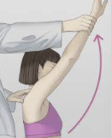

# Neers test
Q. Beskriv en *[[Neers test]]*.
A. 

Q. Hvad tester en *[[Neers test]]* for?
A. *[[Subacromialt impingement syndrom]]*

Q. Hvilke test kan bruges til at teste for *[[Subacromialt impingement syndrom]]*?
A. *[[Neers test]]*, *[[Hawkins test]]*

## Backlinks
* [[Subacromialt impingement syndrom]]
	* Q. Hvilke test kan bruges til at teste for *[[Subacromialt impingement syndrom]]*?
* [[Neers test]]
	* Q. Beskriv en *[[Neers test]]*.

	* Q. Hvad tester en *[[Neers test]]* for?
	* Q. Hvilke test kan bruges til at teste for *[[Subacromialt impingement syndrom]]*?
* [[Undersøgelse af skulder]]
	* [[Neers test]]
* [[Us. af skulder]]
	* Ingen painful arc, neg. [[Hawkins test]], [[Neers test]], [[Empty can test]], udadrotationstest. 

<!-- #anki/tag/med/Orto #anki/deck/Medicine -->

<!-- {BearID:D79105BE-EA9C-456D-B3FF-5771D390DDF0-86299-00012F788564DC7A} -->
