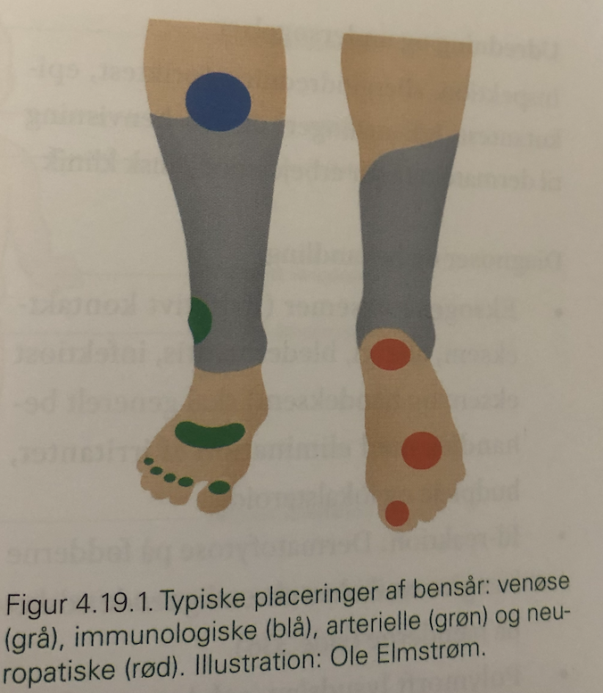

# Neuropatisk diabetisk fodsår
Q. Hvad er mekanismen bag neuropatiske fodsår?
A. Motorisk neuropati (nedsat muskelvolumen, tådeformitet), sensorisk (tolererer friktion) og autonom (tør og skællende hud).

Q. Hvad er behandlingen af et [[Neuropatisk diabetisk fodsår]]?
A. Total vægtaflastning, dernæst gradvis belastning med bandage.

Q. En patient har et [[Neuropatisk diabetisk fodsår]]. Vægtaflastning har ikke haft effekt. Hvad nu?
A. Overvej infektion, alternativt [[Angiopatisk diabetisk fodsår]].

Q. En patient har fået behandlet et [[Neuropatisk diabetisk fodsår]] med total vægtaflastning, og såret er helet. Hvordan undgås recidiv?
A. Optimeret BS, tilpassede sko, evt. kirurgi ved abnorme fremspring, hudpleje, fodterapi. 

Q. Hvor sidder et [[Neuropatisk diabetisk fodsår]] typisk?
A. Under foden eller andre trykpunkter.

## Backlinks
* [[Neuropatisk diabetisk fodsår]]
	* Q. Hvad er behandlingen af et [[Neuropatisk diabetisk fodsår]]?
	* Q. En patient har et [[Neuropatisk diabetisk fodsår]]. Vægtaflastning har ikke haft effekt. Hvad nu?
	* Q. En patient har fået behandlet et [[Neuropatisk diabetisk fodsår]] med total vægtaflastning, og såret er helet. Hvordan undgås recidiv?
	* Q. Hvor sidder et [[Neuropatisk diabetisk fodsår]] typisk?

* [[Diabetiske fodsår]]
	* Q. Hvilke diabetiske fodsår er smertefri?
	* [[Neuropatisk diabetisk fodsår]]

<!-- #anki/tag/med/Orto #anki/deck/Medicine #anki/tag/med/Endocrinology -->

<!-- {BearID:07DAF3DE-486B-4F11-B805-251AE63AE50D-71605-0000A146A4D9AF87} -->
