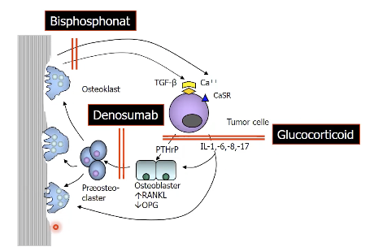
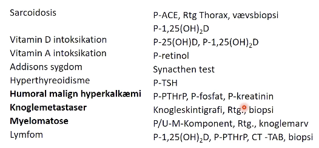

# Non-parathyroid hypercalcæmi
## Generelt

## Differentialdiagnose
Q. Hvad er de primære årsager til [[Hypoparathyroid hypercalcæmi]] på hospital?
A. 1) *Cancer*, 2) Medicin, 3) [[Hyperthyreose (for udredning, se Thyrotoxikose)]], 4) Øget optag fra tarm ([[Sarkoidose]])

Q. Hvordan kan cancer give labil [[Hypercalcæmi]]?
A. 1) Langt overvejende: Knoglenedbrydning og frisætning af Ca2+ (e.g. [[Myelomatose]] eller metastaser), 2) [[PTHrP]], 3) Via inflammatoriske markører der stimulerer osteoblaster

## Udredning
### Anamnese

### Objektiv us.

### Paraklinik

## Behandling
Q. Din patient har [[Hypoparathyroid hypercalcæmi]]. Hvad er behandlingen?
A. 1) Behandl akut hypercalcæmi (se [[Hypercalcæmi]]), 2) Behandl udløsende årsag, *efter et par dage*, 3) [[Bisfosfonat]]/[[RANKL-antagonister]]

## Opfølgning

## Prognose

## Backlinks
* [[Hypercalcæmi]]
	* Q. Hvordan opdeles [[Hypercalcæmi]] overordnet ætiologisk?

<!-- #anki/tag/med/Endocrinology #anki/deck/Medicine -->

<!-- {BearID:0B980DCA-0FA7-4AC0-922C-6CDC31D68618-37279-00005B15A2B7F35B} -->
