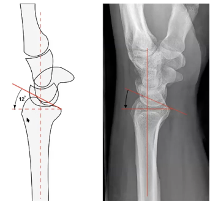
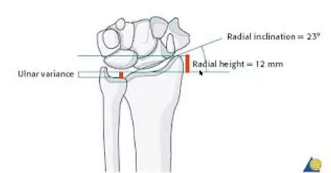
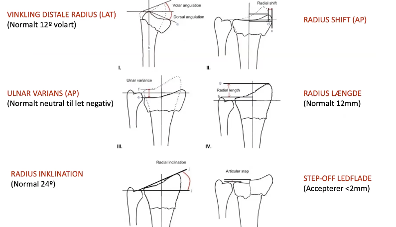

# Normalanatomi i håndleddet
## Generelt

## Differentialdiagnose

## Udredning
### Anamnese

### Objektiv us.

### Paraklinik
Q. Hvad er den normale vinkling i radioscaphoidal-leddet?
A. 12 grader volart.

## Behandling

## Opfølgning

## Prognose
 

## Backlinks
* [[Distal radius-fraktur]]
	* [[Normalanatomi i håndleddet]]

<!-- #anki/tag/med/Orto #anki/deck/Medicine -->

<!-- {BearID:B737BA88-F934-43A0-A893-21717A52B386-15618-000020896708E9C1} -->
