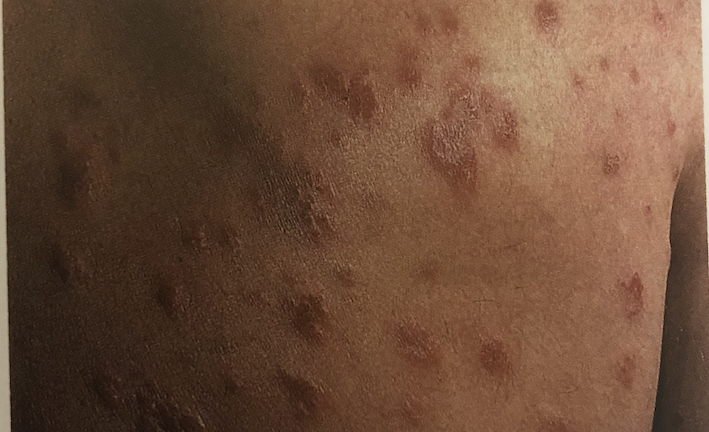

# Nummulat dermatitis
Q. Hvad ses her?

A. [[Nummulat dermatitis]]

Synonymt med diskoidt eksem.

Q. Hvad er den typiske årsag til [[Nummulat dermatitis]]?
A. Ukendt

Q. Hvilke differentialdiagnoser er der til [[Nummulat dermatitis]]?
A. [[Dermatofytose (tinea)]], [[Psoriasis]], [[Lichen planus]] eller [[Kontaktdermatitis]].

Q. Hvordan behandles [[Nummulat dermatitis]]? 
A. [[Lokalt steroid]]

## Backlinks
* [[Atopisk dermatitis]]
	* [[Ichthyosis]]
[[Kontaktdermatitis]]
[[Nummulat dermatitis]]
[[Scabies]]
* [[Nummulat dermatitis]]
	* Q. Hvad ses her?
A. [[Nummulat dermatitis]]
	* Q. Hvad er den typiske årsag til [[Nummulat dermatitis]]?
	* Q. Hvilke differentialdiagnoser er der til [[Nummulat dermatitis]]?
	* Q. Hvordan behandles [[Nummulat dermatitis]]? 
* [[Dermatitis]]
	* [[Endogen dermatitis]]
	[[Seboroisk dermatitis]]
	[[Nummulat dermatitis]]
	[[Stasedermatitis]]
	[[Vesikuløs hånddermatitis]]
	[[Hyperkeratotisk hånddermatitis]]

<!-- #anki/tag/med/Derma #anki/deck/Medicine -->

<!-- {BearID:FB6F70F9-D0BF-47AE-B356-A410519809C7-43570-00004BEC08F248D7} -->
