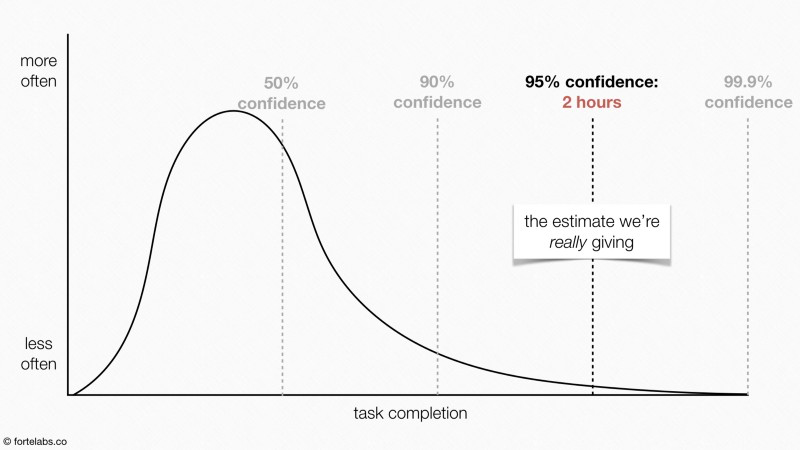

# Optimise the critical chain
Based on the tenet that we are under-confident as individuals (given that people are depending on our estimate), but over-confident as a group or when no-one depends on the estimate.

This is systematically emphasised since we’re not rewarded for finishing early; we’re typically penalised by being given more work.

The purpose is to [[Decrease lag time]] by:
1. Convincing various resources to cut lead time estimates
2. Eliminating completion due dates for individual steps (since they signal “time to spare”, making delays accumulate while advances do not)
3. Frequent reporting of expected completion times, so we can focus efforts where it matters

3. Is a bit dangerous from a BPN perspective I think, but it probably be tremendously effective.

[[Decrease dependencies]] 

[[Can I use lead time estimates to plan meetings]]

## Backlinks
* [[Decrease lag time]]
	* How, then, do we decrease lag time? Some of the answer is probably in [[Optimise the critical chain]], much of it is in [[Minimise multitasking]]
* [[Optimise the academic feedback cycle]]
	* Furthermore, look into notes on [[Optimise constraints]] and [[Optimise the critical chain]].
* [[Work well with collaborators]]
	* For the mechanics themselves, [[Sequence matters when I am not the bottleneck]], [[Optimise constraints]] and [[Optimise the critical chain]].
* [[Balance waiting]]
	* If multiple resources,  [[Optimise the critical chain]].

<!-- #Work -->

<!-- {BearID:E69F4C5D-09F8-477A-A7B3-83F8859873A3-15756-0000130BE30CC698} -->
