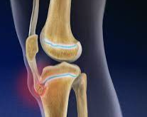

# Osgood-Schlatters sygdom
## Generelt
10-15 år. Idrætsudøvere som dyrker løb eller spring.

## Differentialdiagnose

## Udredning
### Anamnese
Hævelse og smerter svarende til lig. patellas tilhæftning.

### Objektiv us.
Q. Din patient har hævelse og smerter her:

Hvilken diagnose mistænker du, og hvad er behandlingen?
A. [[Osgood-Schlatters sygdom]], ingen. 

### Paraklinik

## Behandling
Fysisk aktivitet til smertegrænse, fysioterapi har ingen plads.

## Opfølgning

## Prognose
1-2 år, ophører spontant.

## Backlinks
* [[Osgood-Schlatters sygdom]]
	* Q. Din patient har hævelse og smerter her:
Hvilken diagnose mistænker du, og hvad er behandlingen?
A. [[Osgood-Schlatters sygdom]], ingen. 
* [[§Knæet]]
	* *Børn*
[[Osgood-Schlatters sygdom]]
[[Vokseværk]]
[[Forskellig benlængde (anisomeli)]].

<!-- #anki/tag/med/gp #anki/deck/Medicine #anki/tag/med/Orto -->

<!-- {BearID:7FD15F01-6A6A-4E47-9B55-B3EDED448CD4-53319-00006D10DC7C1A56} -->
