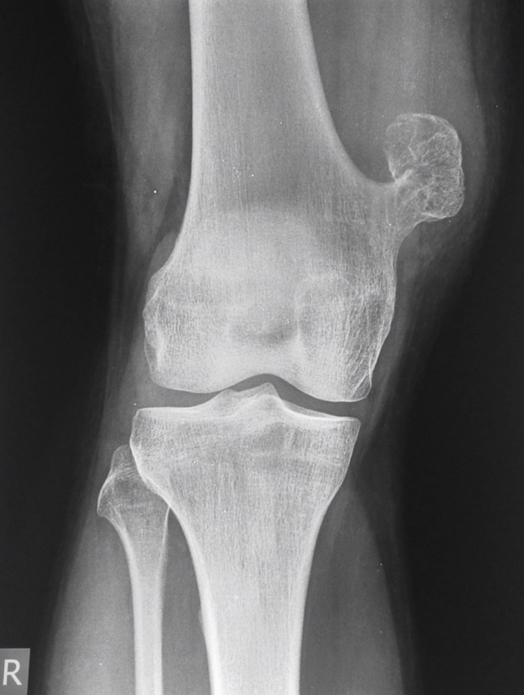

# Osteokondrom
Q. Hvad betyder osteokondrom? 
A. En bruskbeklædt knogleprojektion

Q. En patient oplever en bruskbeklædt knogleprojektion. Hvad hedder det? 
A. Osteokondrom

Q. Hvad ses her?

A. Osteokondrom

## Backlinks
* [[Knogletumores]]
	* [[Knoglecyste]]
[[Fibrøs kortikal defekt]]
[[Fibrøs dysplasi]]
[[Osteoidt osteom]]
[[Osteoklastom]]

<!-- #anki/tag/med/Orto #anki/deck/Medicine -->

<!-- {BearID:9442BBB2-7D86-4333-B003-1FF0962D6AEE-24378-0000E9ADB3D84233} -->
