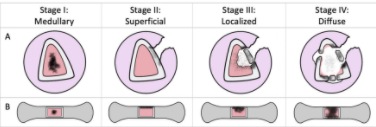
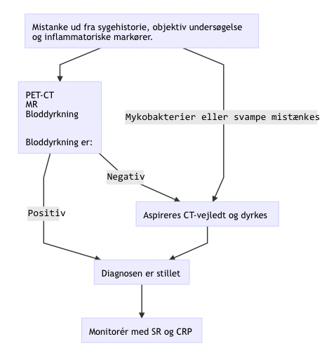

# Osteomyelitis
Q. Hvad er symptomerne ved [[Osteomyelitis]]?
A. Generelle inflammationssymptomer og smerter

Q. Hvad er de hyppigste årsager til [[Osteomyelitis]]?
A. Traume eller hæmatogen spredning.

Q. Hvordan medfører [[Osteomyelitis]] knogletab?
A. Gradvis pusdannelse -> Trykstigning i knogle -> Afklemning af blodforsyning

Q. Hvordan klassificeres osteomyelitis anatomisk?
A. 1) Medællar, 2) Superficielt, 3) Lokaliseret, 4) Diffus

Q. Hvilke fund kan ses på rtg. ved osteomyelit?
A. Involucrum (periostal belægning), absces.

Q. Hvor hyppigt ses recidiv ved [[Osteomyelitis]] efter korrekt behandling?
A. 10%

## Udredning

Q. Hvordan udredes for om en pt. har [[Osteomyelitis]]?
A. PET-CT, MR og bloddyrkning. Hvis mykobakterier eller svampe mistænkes, CT-vejledt aspiration.

Q. En pt. har fået taget PET-CT, MR og bloddyrkning for osteomyelit. De er negative. Hvad nu?
A. Diagnosen kan ikke endegyldigt afkræftes, overvej CT-vejledt aspiration.

## Backlinks
* [[Osteomyelitis]]
	* Q. Hvad er symptomerne ved [[Osteomyelitis]]?
	* Q. Hvad er de hyppigste årsager til [[Osteomyelitis]]?
	* Q. Hvordan medfører [[Osteomyelitis]] knogletab?
	* Q. Hvor hyppigt ses recidiv ved [[Osteomyelitis]] efter korrekt behandling?
	* Q. Hvordan udredes for om en pt. har [[Osteomyelitis]]?
* [[Infektioner i ryggen]]
	* [[Spondylitis]] og [[Spondylodiskitis]] er grundlæggende to subtyper of [[Osteomyelitis]], og derfor gælder de generelle principper derfra.
* [[Ortopædkirurgiske infektioner]]
	* [[Osteomyelitis]]

<!-- #anki/tag/med/Orto #anki/deck/Medicine -->

<!-- {BearID:6B7614D1-9725-4065-B29A-9F2415D01CA1-71605-00009B2478EA8C1E} -->
