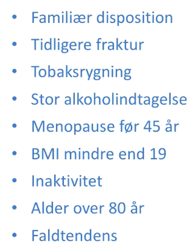
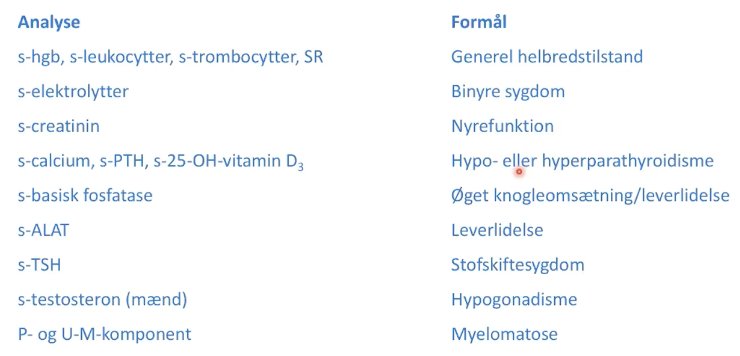
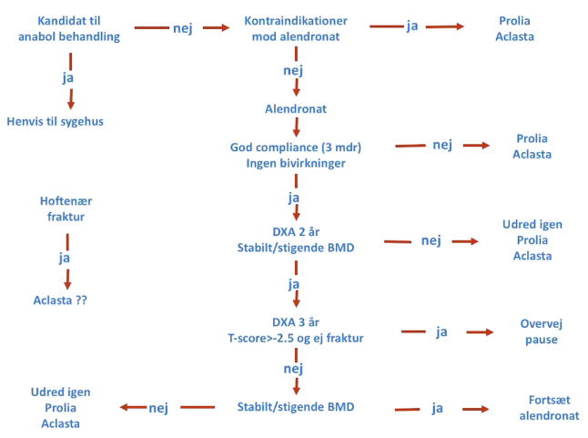
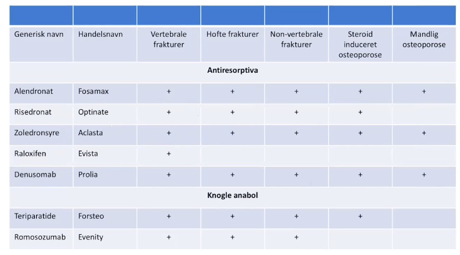

# Osteoporose
## Generelt
Q. Hvad er de primære mekanismer bag aldersbetinget [[Osteoporose]]?
A. 1) Nedsat aktivering af Vit D i hud og nyre, 2) Nedsat osteoblastaktivitet, 3) I postmenopausale kvinder, nedsat s-Østradiol

## Differentialdiagnose

## Risikofaktorer
Q. Hvilke årsager til [[Osteoporose]] er reversible?
A. I) [[Glucokortikoid]], E) [[Hyperthyreose (for udredning, se Thyrotoxikose)]]

Q. Hvilke idiopatiske  *risikofaktorer* findes til [[Osteoporose]]?
A. Aldring

Q. Hvilke iatrogene  *risikofaktorer* findes til [[Osteoporose]]?
A. [[Glucokortikoid]]

Q. Hvilke traumatiske  *risikofaktorer* findes til [[Osteoporose]]?
A. Parental hoftefraktur eller tidl. [[Lavenergifraktur]]

Q. Hvilke autoimmune  *risikofaktorer* findes til [[Osteoporose]]?
A. [[Rheumatoid artrit (RA)]], [[Sarkopeni]]

Q. Hvilke metaboliske  *risikofaktorer* findes til [[Osteoporose]]?
A. Lavt vitamin-D indtag

Q. Hvilke alkoholiske  *risikofaktorer* findes til [[Osteoporose]]?
A. [[Alkoholisme]]

Q. Hvilke behavioristiske  *risikofaktorer* findes til [[Osteoporose]]?
A. [[Rygning]], [[Anoreksi]]

Q. Hvilke congenitte  *risikofaktorer* findes til [[Osteoporose]]?
A. Kvinde, mørk hud

Q. Hvilke endokrine  *risikofaktorer* findes til [[Osteoporose]]?
A. [[Hyperthyreose (for udredning, se Thyrotoxikose)]], [[Type 1 diabetes]]

## Udredning
### Anamnese

### Objektiv us.
Q. Hvad undersøges ved den objektive undersøgelse for [[Osteoporose]]?
A. 1) Øjne (OBS [[Osteogenesis imperfecta]]), 2) Sikkerhed ved gang, 3) Balance, 4) Højde, 5) Ryggens krumning, 6) Pekussion af proc. spinosi, 7) [[Crista-costa afstand]], 8) Vægt

### Paraklinik

Blot *en* af disse + menopause/alder over 50 fører til anbefalet [[DEXA]].

Q. Hvordan kan man få diagnosen [[Osteoporose]]?
A. *Enten* 1) Lavenergifraktur af vertebra eller hofte, 2) [[T-score]] under -2.5

Q. Din patient er blevet DEXA-scannet OBS osteoporose. T-score -2.2 for hofte og -2.8 for lænd. Hvad nu?
A. Har [[Osteoporose]], da mindste værdi afgør kriteriet. Igangsæt behandling.

Q. Hvilke blodprøver udover “standardpakken” bestiller vi ved OBS [[Osteoporose]]?
A. 1) [[PTH]], 2) [[TSH]], 3) [[D-vitamin]], 4) [[M-komponent]], 5) [[PSA]], 6) [[Basisk fosfatase]]

## Behandling

[[Primær profylakse]]
[[Sekundær profylakse]]
[[Tertiær profylakse]]
	[[Tertiær profylakse for osteoporose]]

Q. Hvad er de overordnede behandlingsprincipper for [[Osteoporose]]?
A. 1) Kalk + D3, 2) Farmakologisk

Af farmakologisk antiresorbtiv behandling kan nævnes: 
1. [[Bisfosfonat]]
	1. [[Zolendronat (aclasta)]]
	2. [[Alendronat]]
2. [[Denosumab (prolia)]]

Ikke:
	4. [[Raloxifen]]

Og knoglenanabol behandling:
1. [[Teriparatid]], større effekt end [[Bisfosfonat]]
2. [[Romosozumab]]

Q. Hvilke patienter med [[Osteoporose]] anbefales knogleanabol behandling?
A. Patienter med enten 1) T-score < -3 + vertebral fraktur > 25% eller 2) Mere end en vertebrale fraktur

Q. Nævn et eksempel på knogleanabol behandling af [[Osteoporose]].
A. [[Teriparatid]], [[Romosozumab]]

Q. En patient har haft [[Osteoporose]] og en hoftefraktur. Behandlet med [[Bisfosfonat]]. Under hvilke omstændigheder bør overvejes pause?
A. 1) Ingen vertebral fraktur, 2) T-score > -2.5, 3) Ingen frakturer i behandlingsperioden

Q. En 80-årig kvinde har haft en radius-fraktur, T-score -2.7. Hvilken farmakologisk beh.?
A. Hvis ingen vertebrale frakturer: 1) Kalk + D3, 2) [[Bisfosfonat]]

Q. En 80-årig kvinde har haft en radius-fraktur. Hvad nu?
A. OBS [[Osteoporose]]. Lav [[DEXA]]. Hvis abnorm, 1) Kalk + D3, 2) [[Bisfosfonat]]

Q. Din patient er opstart i 7,5 mg prednison for [[Polymyalgia rheumatica]]. Hvad nu?
A. OBS [[Osteoporose]]. [[DEXA]]. Hvis T-score < 1 (ja, allerede ved osteopeni!), opstart behandling.

## Opfølgning

## Prognose

## Risikofaktorer

## Backlinks
* [[Osteoporose]]
	* Q. Hvad er de primære mekanismer bag aldersbetinget [[Osteoporose]]?
	* Q. Hvilke årsager til [[Osteoporose]] er reversible?
	* Q. Hvilke idiopatiske  *risikofaktorer* findes til [[Osteoporose]]?
	* Q. Hvilke iatrogene  *risikofaktorer* findes til [[Osteoporose]]?
	* Q. Hvilke traumatiske  *risikofaktorer* findes til [[Osteoporose]]?
	* Q. Hvilke autoimmune  *risikofaktorer* findes til [[Osteoporose]]?
	* Q. Hvilke metaboliske  *risikofaktorer* findes til [[Osteoporose]]?
	* Q. Hvilke alkoholiske  *risikofaktorer* findes til [[Osteoporose]]?
	* Q. Hvilke behavioristiske  *risikofaktorer* findes til [[Osteoporose]]?
	* Q. Hvilke congenitte  *risikofaktorer* findes til [[Osteoporose]]?
	* Q. Hvilke endokrine  *risikofaktorer* findes til [[Osteoporose]]?
	* Q. Hvad undersøges ved den objektive undersøgelse for [[Osteoporose]]?
	* Q. Hvordan kan man få diagnosen [[Osteoporose]]?
	* Q. Din patient er blevet DEXA-scannet OBS osteoporose. T-score -2.2 for hofte og -2.8 for lænd. Hvad nu?
	* Q. Hvilke blodprøver udover “standardpakken” bestiller vi ved OBS [[Osteoporose]]?
	* Q. Hvad er de overordnede behandlingsprincipper for [[Osteoporose]]?
	* Q. Hvilke patienter med [[Osteoporose]] anbefales knogleanabol behandling?
	* Q. Nævn et eksempel på knogleanabol behandling af [[Osteoporose]].
	* Q. En patient har haft [[Osteoporose]] og en hoftefraktur. Behandlet med [[Bisfosfonat]]. Under hvilke omstændigheder bør overvejes pause?
	* Q. En 80-årig kvinde har haft en radius-fraktur. Hvad nu?
	* Q. Din patient er opstart i 7,5 mg prednison for [[Polymyalgia rheumatica]]. Hvad nu?
* [[Toxisk multinodøs struma]]
	* Q. Din patient får diagnosticeres [[Toxisk multinodøs struma]]. Hvad vil du tilføje til paraklinik?
* [[Prednisolon]]
	* Q. En 55-årig kvinde opstartes i 5 mg. [[Prednisolon]] p.o. dgl. Hvad bør gøres?
	* Q. En 55-årig kvinde opstartes i 5 mg. [[Prednisolon]] p.o. dgl. i måneder. Henvises til [[DEXA]], T-score = -1.3. Hvad bør gøres?
	* Q. Hvorfor er [[Prednisolon]] knoglebeskyttende ved cancer men knoglenedbrydende ved [[Osteoporose]]?
	* Q. Hvorfor er [[Prednisolon]] knoglebeskyttende ved cancer men knoglenedbrydende ved [[Osteoporose]]?
* [[Cushing’s syndrom]]
	* Q. Hvilke parakliniske fund tyder på [[Cushing’s syndrom]]?
* [[Glucokortikoid]]
	* Q. Hvorfor kan [[Glucokortikoid]] medvirke til [[Osteoporose]]?
* [[Primær hyperparathyroidisme]]
	* Q. Din patient har [[Primær hyperparathyroidisme]]. Hvad vil du spørge til og undersøge for at finde ud af, om han skal behandles?
* [[Hyperparathyroidisme]]
	* Stones ([[Nyresten]], [[Galdesten]]).
Abdominal groans ([[Obstipation]]).
Psychic moans (kognitiv påvirkning, [[Depression (diagnosis)]]).
* [[Crista-costa afstand]]
	* Q. Hvilken test kan bruges i den objektive undersøgelse for [[Osteoporose]]?
* [[Lavenergifraktur]]
	* Q. En patient har fået en [[Lavenergifraktur]]. Hvad kan det skyldes?
* [[Tertiær profylakse for osteoporose]]
	* Q. Hvilke non-farmakologiske faktorer indgår i [[Tertiær profylakse]] for [[Osteoporose]]?
* [[Acetabulumfraktur]]
	* Q. Hvilken mekanisme er oftest årsagen til acetabulumfraktur?
* [[Osteoporose i graviditeten]]
	* [[Osteoporose]] i [[Graviditet]]. Sjælden, recidiverer sjældent.
	* Q. Hvad er prognosen for [[Osteoporose i graviditeten]]?
* [[Bækkenfraktur]]
	* Q. Hvilke patienter oplever bækkenringsfrakturer?
* [[Kompressionsfraktur]]
	* Q. Din patient har to vertebrale frakturer. Hvad mistænker du?

<!-- #anki/tag/med/Endocrinology #anki/deck/Medicine -->

<!-- {BearID:8107941A-3105-43CB-AD81-1CE04DBF565A-24378-0000E7D9B4598647} -->
