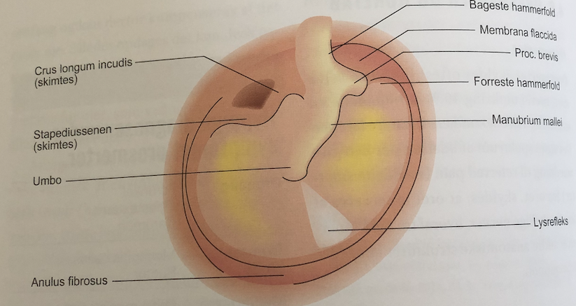

# Otoskopi

## Backlinks
* [[Svimmelhed]]
	* Q. Din patient viser symptomer på [[Svimmelhed]]. Hvad vil du tilføje *den objektive us.*? 
* [[Akut otitis media]]
	* Q. Din patient viser symptomer på [[Akut otitis media]]. Hvad vil du tilføje til *paraklinikken*? 
	* Q. Din patient i AP er et barn mistænkt for [[Akut otitis media]]. Alment påvirket, men på trods af bedst mulig teknik kan du ikke få lov til at at lave [[Otoskopi]], ej heller kan dine kolleger. Hvad nu?
* [[Otalgi]]
	* Q. Din patient viser symptomer på [[Otalgi]]. Hvad vil du tilføje *den objektive us.*? 

<!-- #anki/deck/Medicine #anki/tag/med/Otolarynghology #anki/tag/med/GP -->

<!-- {BearID:87AC9CC2-5F39-4F9B-AC7B-A3E81489350D-65488-0000702D44EDB736} -->
