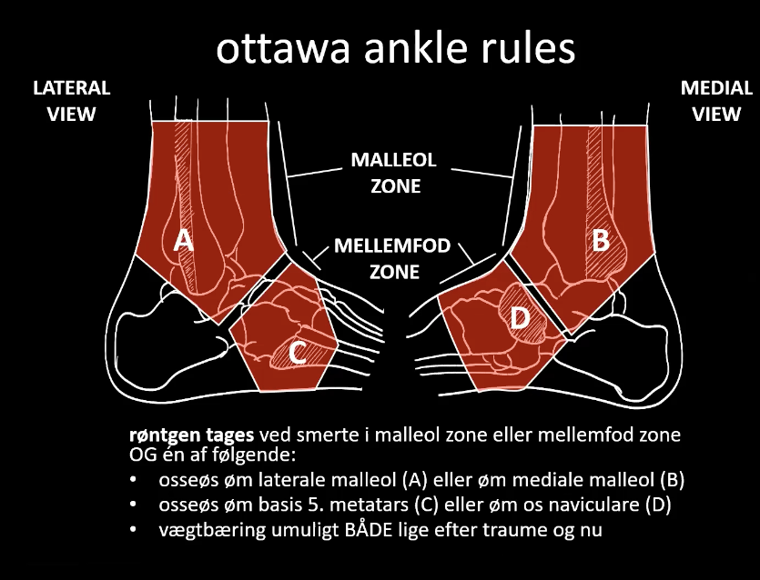

# Ottowa ankle rules
## Generelt

Q. Hvad indgår i [[Ottowa ankle rules?]]
A. Enten A) Ømhed over enten 1) Post. lateral malleol, 2) Post. medialt malleol, 3) Os naviculare eller 4) Basis 5. meta-tars eller B) Vægtbæring umuligt *både* lige efter traume og nu.

## Differentialdiagnose

## Udredning
### Anamnese

### Objektiv us.

### Paraklinik

## Behandling

## Opfølgning

## Prognose
 

## Backlinks
* [[Ankeltraume]]
	* [[Ottowa ankle rules]]

<!-- #anki/tag/med/Orto #anki/deck/Medicine -->

<!-- {BearID:5800F119-00B3-431C-9923-37EFFCE0DF08-7035-0000220DD8712EAA} -->
