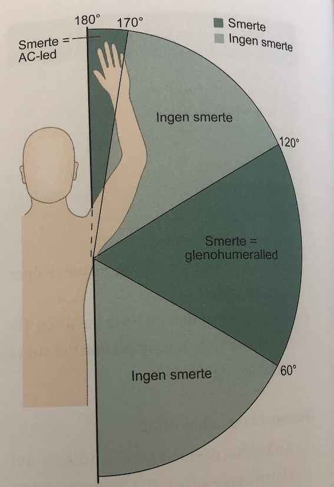

# Painful arc
Q. Beskriv *painful arc* i *skulderen*.
A. Passiv bevægelse af overarm som nedenfor:

Q. Hvad tester *painful arc* for i *skulderen*?
A. Impingement syndrom, tendinitis eller inkomplet supraspinatus læsion

Q. Hvad er et abnormt resultat af *painful arc* i *skulderen*?
A. Smerter når moderat abduceret

## Backlinks
* [[Subacromialt impingement syndrom]]
	* Q. Hvilke test kan bruges til at teste for *[[Subacromialt impingement syndrom]]*?
* [[Empty can test]]
	* Q. Hvilken test kan bruges til at teste for *[[Supraspinatus tendinit]]*?
* [[Undersøgelse af skulder]]
	* [[Painful arc]]

<!-- #anki/tag/med/Orto #anki/deck/Medicine #anki/tag/med/GP -->

<!-- {BearID:38B3CE7A-D0A2-470A-98DF-8D966228BD1D-53319-00007012684C00E0} -->
