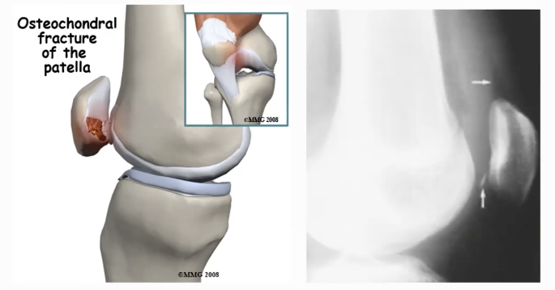
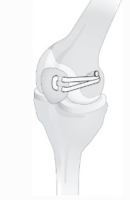

# Patellaluksation
## Generelt

## Differentialdiagnose

## Udredning
### Anamnese

### Objektiv us.

### Paraklinik
Q. Din patient viser symptomer på [[Patellaluksation]]. Hvad vil du tilføje til *paraklinikken*? 
A. *Altid* rtg., OBS osteokondral læsion af patella.

## Behandling
Får lavet kunstig/opstrammer medial patellofemoralt lig. hvis kronisk, trænet og færdig udvokset.

Q. Hvordan behandles [[Patellaluksation]] i det akutte?
A. Ekstension af knæet, dernæst 0-30 hængselbandage i 2 uger.

Q. Hvornår skal en [[Patellaluksation]] henvises til orto?
A. 2.-gangsluksation eller barn

Behandles med kunstig MPFL.

## Opfølgning

## Prognose
 
## Backlinks
* [[Patellaluksation]]
	* Q. Din patient viser symptomer på [[Patellaluksation]]. Hvad vil du tilføje til *paraklinikken*? 

	* Q. Hvordan behandles [[Patellaluksation]] i det akutte?
	* Q. Hvornår skal en [[Patellaluksation]] henvises til orto?
* [[Knætraume]]
	* [[Menisklæsion]]
[[Posterior hofteluksation]]
[[Knæluksation]]
[[Patellaluksation]]

<!-- #anki/tag/med/Orto #anki/deck/Medicine -->

<!-- {BearID:918769A3-0378-4AB3-BFFF-B7DC42EB48C4-7151-000014428436DC6F} -->
