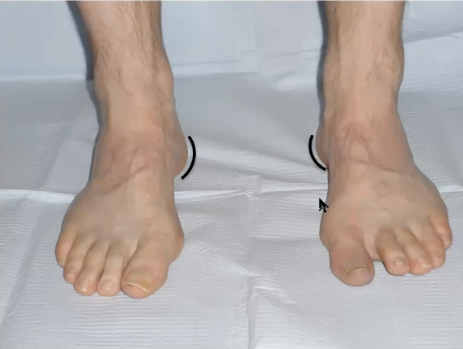

# Peeking heel sign
Q. Beskriv et *[[Peeking heel sign]]*.
A. 

Q. Hvad tester *[[Peeking heel sign]]* for?
A. *[[Hulfod]]*

Q. Hvilken undersøgelse kan bruges til at teste for *[[Hulfod]]*?
A. *[[Peeking heel sign]]*

Q. Hvad er et abnormt resultat af en *[[Peeking heel sign]]*?
A. Man kan se hælen når man ser pt. forfra

## Backlinks
* [[§Ankel]]
	* [[Undersøgelse af fod]]
[[Peeking heel sign]]
* [[Peeking heel sign]]
	* Q. Beskriv et *[[Peeking heel sign]]*.
	* Q. Hvad tester *[[Peeking heel sign]]* for?
	* Q. Hvilken undersøgelse kan bruges til at teste for *[[Hulfod]]*?
	* Q. Hvad er et abnormt resultat af en *[[Peeking heel sign]]*?
* [[Undersøgelse af fod]]
	* [[Peeking heel sign]]
* [[Us. af fod og ankel]]
	* *Inspektion:*

<!-- #anki/tag/med/Orto #anki/deck/Medicine #anki/tag/med/GP -->

<!-- {BearID:421CCE9E-41A5-4930-B83C-38CE20935EE8-18513-00001A621659DDD0} -->
