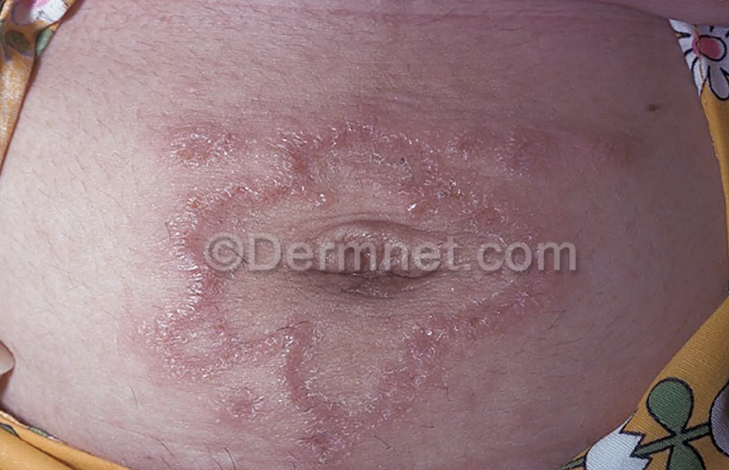
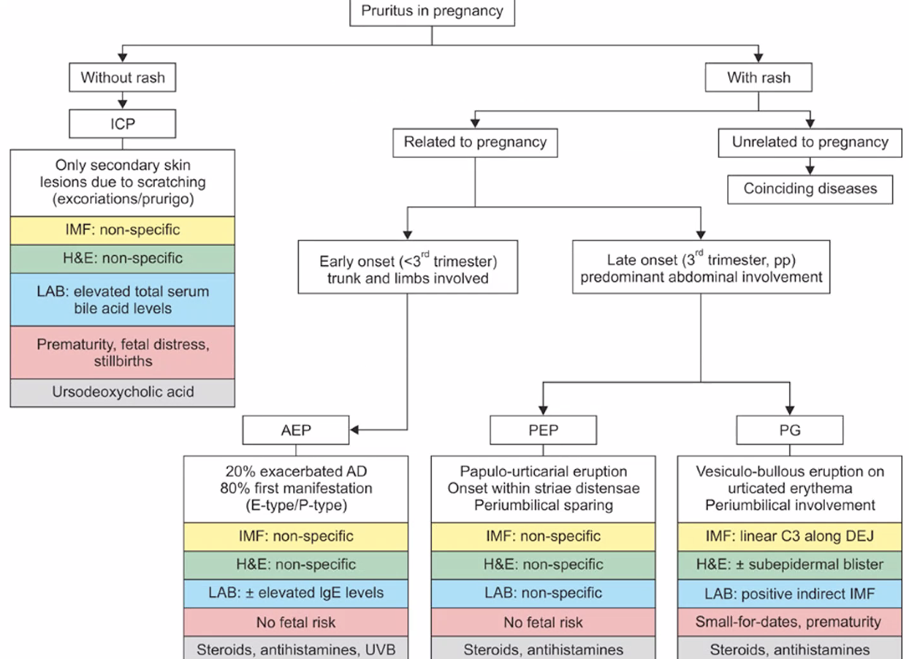

# Pemphigus gestationes
## Generelt

## Differentialdiagnose

## Udredning
### Anamnese

### Objektiv us.

### Paraklinik

## Behandling

## Opfølgning

## Prognose

## Backlinks
* [[Graviditetskløe]]
	* 
PEP: Pruritisk urtikarielle papler og plaques
PG: [[Pemphigus gestationes]]

<!-- #anki/tag/med/Derma #anki/deck/Medicine -->

<!-- {BearID:91868736-6D19-4227-9910-947AD9B83225-21052-00004E46C11A73B8} -->
