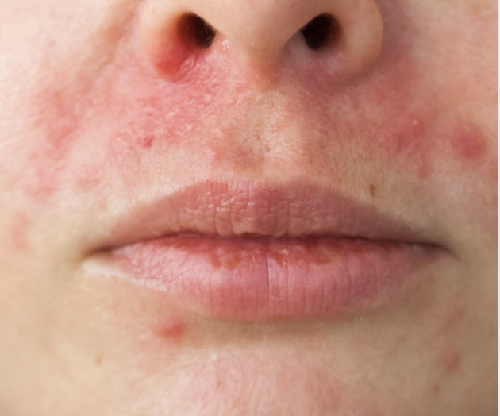

# Perioral dermatitis
## Generelt

## Differentialdiagnose

## Udredning
### Anamnese

### Objektiv us.
Q. Beskriv *S* OCRATES for [[Perioral dermatitis]] 
A. Omkring mund og næsefløje, *men* fri zone omkring prolabiet

Q. Beskriv SO *C* RATES for [[Perioral dermatitis]] 
A. Erytematøst, skællende

Q. Hvad ses her?

A. [[Perioral dermatitis]]

### Paraklinik

## Behandling
Q. Hvordan behandles [[Perioral dermatitis]]?
A. Seponer steroid, opstart [[Metronidazol]]-gel

## Opfølgning

## Prognose

## Backlinks
* [[Rosacea]]
	* Polymorft lysudslæt
[[Perioral dermatitis]]
[[Lupus erythematosus]]
[[Sarkoidose]]
* [[Perioral dermatitis]]
	* Q. Beskriv *S* OCRATES for [[Perioral dermatitis]] 
	* Q. Beskriv SO *C* RATES for [[Perioral dermatitis]] 
	* Q. Hvad ses her?
A. [[Perioral dermatitis]]
	* Q. Hvordan behandles [[Perioral dermatitis]]?

<!-- #anki/tag/med/Derma #anki/deck/Medicine -->

<!-- {BearID:F6DA39BB-999E-49BD-82BF-CE745675CE6A-6575-000007A8D4006A4F} -->
