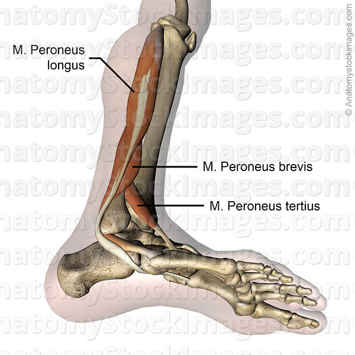

# Peroneusruptur
Q. Hvad er de hyppigste symptomer ved peroneusruptur?
A. Smerter/ømhed bag og under laterale malleol

## Backlinks
* [[Ankelsenelæsioner]]
	* [[Peroneusruptur]]

<!-- #anki/tag/med/Orto #anki/deck/Medicine -->

<!-- {BearID:A1BD7738-31FD-436F-8C1A-0963AE1C6B71-9907-00007DDC56B3679E} -->
