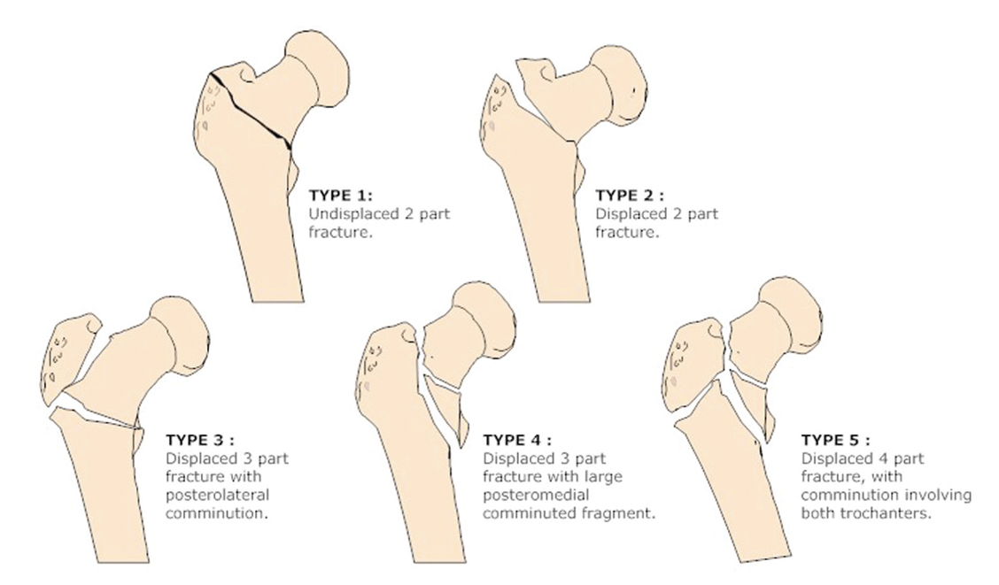
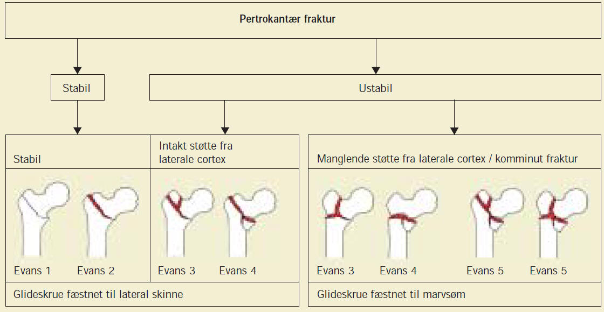
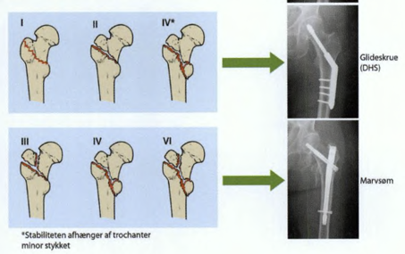

# Pertrokantær femurfraktur
## Generelt
Q. Hvilke typer [[Pertrokantær femurfraktur]] er medialt ustabile?
A. Evans type 3-5

Q. Hvad bruges i sundhedsvæsenet til *Klassifikation af [[Pertrokantær femurfaktur]]*? 
A. *[[Evans typer]]*

Q. Hvad bruges *[[Evans typer]]* til i sundhedsvæsenet? 
A. *Klassifikation af [[Pertrokantær femurfaktur]]* 

## Differentialdiagnose

## Udredning
### Anamnese

### Objektiv us.

### Paraklinik

## Behandling
Q. Hvordan behandler vi [[Pertrokantær femurfraktur]]?
A. *Stabil trokanter minor og ikke meget komminut*  A) Glideskrue og skinne. /Ustabil trokanter minor eller komminut/, B) Glideskrue og marvsøm

## Opfølgning

## Prognose
 

## Backlinks
* [[§Hofte]]
	* [[Proksimal femurfraktur]]
	[[Pertrokantær femurfraktur]]
	[[Subtrokantær femurfraktur]]
* [[Pertrokantær femurfraktur]]
	* Q. Hvilke typer [[Pertrokantær femurfraktur]] er medialt ustabile?
	* Q. Hvordan behandler vi [[Pertrokantær femurfraktur]]?

* [[Proksimal femurfraktur]]
	* Q. Hvordan kategoriseres en [[Proksimal femur-fraktur]]?

<!-- #anki/tag/med/Orto #anki/deck/Medicine -->

<!-- {BearID:F0159038-6DFE-452D-93DE-3A618C300F8B-21052-000040DA9679B903} -->
