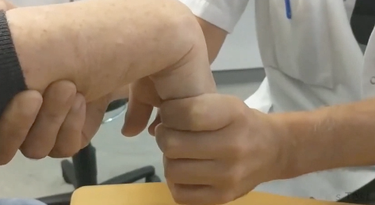

# Phalens test
Q. Beskriv *[[Phalens test]]* i håndled.
A. Volarfleksion i 1 min

Q. Hvad tester *Phalens test* for i håndled?
A. Karpaltunnelsyndrom

Q. Hvad er et abnormt resultat af *Phalens test* i håndled?
A. Paræstesi i radiale fingre

## Backlinks
* [[Phalens test]]
	* Q. Beskriv *[[Phalens test]]* i håndled.

* [[Karpaltunnelsyndrom]]
	* Q. Hvilke kliniske tests findes for karpaltunnelsyndrom?
	* Q. Din patient viser symptomer på [[Karpaltunnelsyndrom]]. Hvad vil du tilføje *den objektive us.*? 

<!-- #anki/tag/med/Orto #anki/deck/Medicine -->

<!-- {BearID:058ED591-83EB-48B7-BEA5-E96A8A55CED8-15088-0000D96E82AE6B4A} -->
