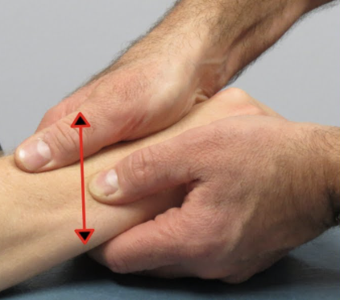

# Piano key sign
## Generelt
Q. Beskriv et *[[Piano key sign]]*.
A. Fikser radius. Træk ulna antero-posteriort.

Q. Hvad tester et *[[Piano key sign]]* for?
A. *[[Radio-ulnar instabilitet]]*

Q. Hvilken test kan bruges til at teste for *[[Radio-ulnar instabilitet]]*?
A. *[[Piano key sign]]*

Q. Hvad er et abnormt resultat af en *[[Piano key sign]]*?
A. Øget antero-posterior mobilitet af ulna.

## Differentialdiagnose

## Udredning
### Anamnese

### Objektiv us.

### Paraklinik

## Behandling

## Opfølgning

## Prognose
 

## Backlinks
* [[Piano key sign]]
	* Q. Beskriv et *[[Piano key sign]]*.

	* Q. Hvad tester et *[[Piano key sign]]* for?
	* Q. Hvilken test kan bruges til at teste for *[[Radio-ulnar instabilitet]]*?
	* Q. Hvad er et abnormt resultat af en *[[Piano key sign]]*?

* [[Us. af hånd og håndled]]
	* Negativ [[Piano key sign]]. 

<!-- #anki/tag/med/Orto #anki/deck/Medicine -->

<!-- {BearID:AB23CF67-013B-4CE0-96AD-EE67EEF8C984-22870-000064BD2C8E2A01} -->
