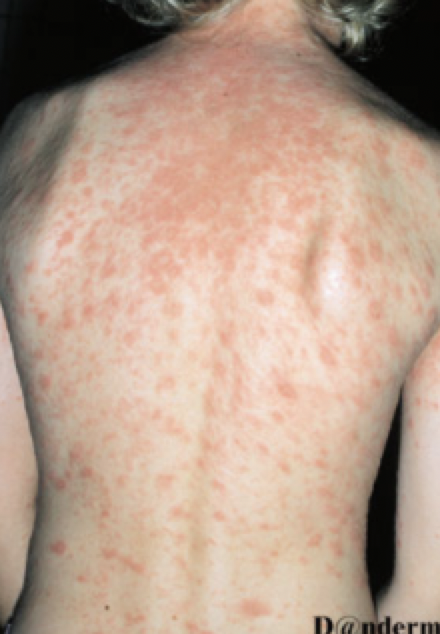
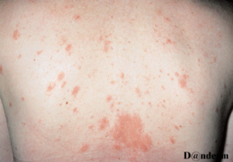
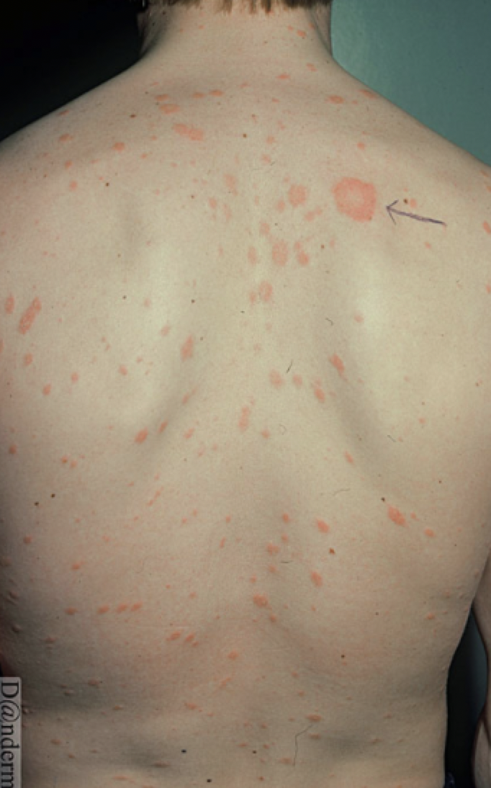
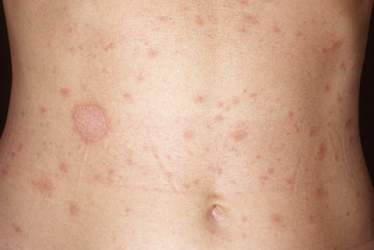

# Pityriasis rosea
## Generelt
Formentlig en virusinfektion. Smitter ikke.

Q. Beskriv eksantemet – Diagnose(r)?

A. Bilat. rødbrune maculae - [[Pityriasis rosea]]

Q. Beskriv eksantemet – Diagnose(r)?

A. Større makulært element med erytem og måske let skældannelse - primærmedaljon. Desuden bilat. rødbrune maculae, evt. med perifær “skælkrave” - [[Pityriasis rosea]]

Q. Beskriv eksantemet – Diagnose(r)?

A. Større makulært element med erytem og måske let skældannelse - primærmedaljon. Desuden symmetrisk fordelte rødbrune maculae, evt. med perifær “skælkrave” - [[Pityriasis rosea]]

Q. Beskriv eksantemet – Diagnose(r)?

A. Større makulært element med erytem og måske let skældannelse - primærmedaljon. Desuden symmetrisk fordelte rødbrune maculae, evt. med perifær “skælkrave” - [[Pityriasis rosea]]

## Differentialdiagnose
[[Syfilis]]
[[HIV]]

Primært, hvis udslettet ikke er så skellende.

## Udredning
### Anamnese

### Objektiv us.

Q. Beskriv *S* OCRATES for [[Pityriasis rosea]] 
A. Typisk i T-shirt-området

Q. Beskriv S *O* CRATES for [[Pityriasis rosea]] 
A. Primær-medaljon (dog ikke obligat)

Q. Beskriv SO *C* RATES for [[Pityriasis rosea]] 
A. Kløende, symmetrisk makulært udslet

Q. Beskriv SOCRA *T* ES for [[Pityriasis rosea]] 
A. Forsvinder efter 4-10 uger

### Paraklinik

## Behandling
Q. Hvordan behandles [[Pityriasis rosea]]?
A. Typisk ikke. Evt. ved kløe gruppe II eller III steroid.

## Opfølgning

## Prognose
Ses kun en gang i livet.

## Backlinks
* [[Syfilis]]
	* [[Pityriasis rosea]]
[[Psoriasis]]
* [[Psoriasis]]
	* Q. Hvordan adskilles [[Pityriasis rosea]] fra [[Psoriasis vulgaris]]?
	* Q. Hvordan adskilles [[Pityriasis rosea]] fra [[Psoriasis vulgaris]]?
* [[Pityriasis rosea]]
	* Q. Beskriv eksantemet – Diagnose(r)?
A. Bilat. rødbrune maculae - [[Pityriasis rosea]]
	* Q. Beskriv eksantemet – Diagnose(r)?
A. Større makulært element med erytem og måske let skældannelse - primærmedaljon. Desuden bilat. rødbrune maculae, evt. med perifær “skælkrave” - [[Pityriasis rosea]]
	* Q. Beskriv eksantemet – Diagnose(r)?
A. Større makulært element med erytem og måske let skældannelse - primærmedaljon. Desuden symmetrisk fordelte rødbrune maculae, evt. med perifær “skælkrave” - [[Pityriasis rosea]]
	* Q. Beskriv eksantemet – Diagnose(r)?
A. Større makulært element med erytem og måske let skældannelse - primærmedaljon. Desuden symmetrisk fordelte rødbrune maculae, evt. med perifær “skælkrave” - [[Pityriasis rosea]]
	* Q. Beskriv *S* OCRATES for [[Pityriasis rosea]] 
	* Q. Beskriv S *O* CRATES for [[Pityriasis rosea]] 
	* Q. Beskriv SO *C* RATES for [[Pityriasis rosea]] 
	* Q. Beskriv SOCRA *T* ES for [[Pityriasis rosea]] 
	* Q. Hvordan behandles [[Pityriasis rosea]]?
* [[Akut HIV]]
	* Q. Hvilke *idiopatiske* differentialdiagnoser findes til [[Akut HIV]]?
* [[Guttat psoriasis vulgaris]]
	* Q. Hvilke autoimmune differentialdiagnoser findes til *[[Guttat psoriasis vulgaris]]*?
* [[Skældannelse]]
	* [[Psoriasis]]
[[Kontaktdermatitis]]
[[Pityriasis rosea]]

<!-- #anki/tag/med/Derma #anki/deck/Medicine -->

<!-- {BearID:42CCE2C3-12F3-47D2-8976-EB22C96A511F-959-000007766D3DBF6D} -->
