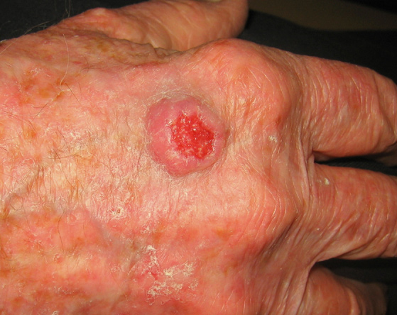

# Planocellulært karcinom
Også kendt som spinocellulært karcinom.

## Generelt

## Differentialdiagnose
Q. Hvilke differentialdiagnoser findes til [[Planocellulært karcinom]]?
A. [[Aktinisk keratose]], [[Keratoakantom]]

Q. Hvordan adskilles [[Planocellulært karcinom]] fra [[Keratoakantom]]?
A. [[Keratoakantom]] udvikles over uger, [[Planocellulært karcinom]] mdr. til år

## Udredning
Q. Hvornår opfattes et [[Planocellulært karcinom]] som højrisiko?
A. En af: S) Øre, læbe, perineum eller i kronisk skadet hud O) Recidivtumor C) > 2 cm, A) Hos immunsupprimeret, histologi abnorm

### Anamnese

### Objektiv us.
Q. Hvad ses her?

A. [[Planocellulært karcinom]] med hornløg centralt

Q. Hvordan adskiller man klinisk [[Planocellulært karcinom]] fra [[Basocellulært karcinom]]?
A. [[Planocellulært karcinom]] er som sandpapir, [[Basocellulært karcinom]] kun let skællende

### Paraklinik

## Behandling
Q. Hvordan behandles [[Planocellulært karcinom]]?
A. Excision hos specialist

## Opfølgning

## Prognose

## Backlinks
* [[Aktinisk keratose]]
	* Forstadiet til [[Planocellulært karcinom]].
* [[Planocellulært karcinom]]
	* Q. Hvilke differentialdiagnoser findes til [[Planocellulært karcinom]]?
	* Q. Hvordan adskilles [[Planocellulært karcinom]] fra [[Keratoakantom]]?
	* Q. Hvordan adskilles [[Planocellulært karcinom]] fra [[Keratoakantom]]?
	* Q. Hvornår opfattes et [[Planocellulært karcinom]] som højrisiko?
	* Q. Hvad ses her?
A. [[Planocellulært karcinom]] med hornløg centralt
	* Q. Hvordan adskiller man klinisk [[Planocellulært karcinom]] fra [[Basocellulært karcinom]]?
	* Q. Hvordan adskiller man klinisk [[Planocellulært karcinom]] fra [[Basocellulært karcinom]]?
	* Q. Hvordan behandles [[Planocellulært karcinom]]?

<!-- #anki/tag/med/Derma #anki/deck/Medicine -->

<!-- {BearID:1F5F4BE7-FB04-4772-9BB8-F889632128C9-30450-00003EEAE2A92E66} -->
