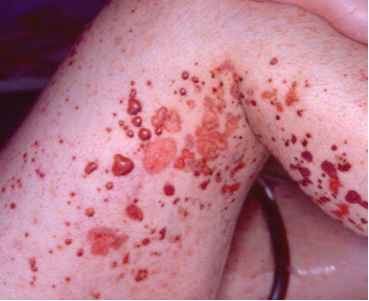

# Polyarteritis nodosa
## Backlinks
* [[Polyarteritis nodosa]]
	* Q. En patient henvender sig med synlige aneurismer på huden. Hvilken sygdom kan der være tale om?

<!-- #anki/deck/Medicine #anki/tag/med/Rheumatology -->

Q. En patient henvender sig med synlige aneurismer på huden. Hvilken sygdom kan der være tale om?
A. [[Polyarteritis nodosa]]

Q. En patient henvender sig med nedenstående billede.

Hvilken sygdom kan der være tale om? 
A. Polyarteritis nodosa

Q. En ung mand er kendt med polyarteritis nodosa. Hvilke organsystemer påvirker sygdommen typisk?
A. Hjerne, nyre, tarme, led og hud

Q. En ung kvinde er kendt med polyarteritis nodosa. Hvilke objektive fund fra tarmen kan skyldes sygdommen?
A. Melæna

<!-- #anki/tag/med/Rheumatology #anki/deck/Medicine -->

<!-- {BearID:139F16B4-561C-407E-8E21-EA07AA261616-13688-0000BC2BA6E6D4FF} -->
