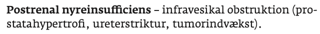

# Postrenalt nyresvigt
## Generelt

## Differentialdiagnose

## Udredning
### Anamnese

### Objektiv us.

### Paraklinik

## Behandling

## Opfølgning

## Prognose
 

## Backlinks
* [[Akut nyresvigt (AKI)]]
	* [[Prærenalt nyresvigt]]
[[Postrenalt nyresvigt]]

<!-- #anki/deck/Medicine# #anki/tag/med/Nephrology -->

<!-- {BearID:5D2E2D50-6DAB-4E6D-ACD5-1F27C0E4F573-15714-000035C806EFF802} -->
