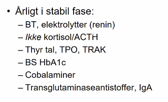

# Primær binyrebarkinsufficiens
## Generelt
Kaldes også [[Addisons sygdom (brug primær binyrebarkinsufficiens)]].  

## Differentialdiagnose
Q. Hvad er de primære årsager til [[Primær binyrebarkinsufficiens]]?
A. 1) Autoimmunitet (21-OH antistoffer), *sjældent* enten 2) Friedrich-Waterhouse syndrom, 3) TB, 4) [[Kongenit adrenal hyperplasi]]

## Udredning

### Anamnese
Q. Din patient viser symptomer på [[Primær binyrebarkinsufficiens]]. Hvilke tegn i *anamnesen*
vil øge sandsynligheden? 
A. 1) Svimmelhed, 2) Salt-craving

### Objektiv us.
Q. Hvilke objektive fund vil tyde på *[[Primær binyrebarkinsufficiens]]*? 
A. 1) [[Ortostatisk hypotension]], 2) Hyperpigmentering, især i bøjefurerne, 3) Vægttab (se [[Primær binyrebarkinsufficiens]])

Q. Hvorfor giver [[Primær binyrebarkinsufficiens]] hyperpigmentering?
A. [[ACTH]] medfører også frigivelse af [[MSH (melanocytstimulerende hormon)]].

### Paraklinik
*Se [[Binyrebarkinsufficiens]]*

Q. Hvad er den biokemiske konsekvens af [[Primær binyrebarkinsufficiens]]?
A. Mangel på [[Mineralocortikoid]] og [[Glucokortikoid]], og dermed forøget [[ACTH]] og [[Angiotensin]]

## Behandling
Døgndosis typisk 15-20 mg., eg. 10 + 5 + 5. 

2-3x ved feber/operation. 

## Opfølgning

## Prognose

## Backlinks
* [[ACTH]]
	* Q. Hvilke objektive fund ses ved *hypo*sekretion af [[ACTH]]? 
* [[Binyrebarkinsufficiens]]
	* [[Akut binyrebarkinsufficiens (brug addisonkrise)]]
[[Sekundær binyrebarkinsufficiens]]
	* Q. Hvordan adskiller man diagnostisk [[Primær binyrebarkinsufficiens]] og [[Sekundær binyrebarkinsufficiens]]?
	* Q. Din patient viser symptomer på [[Primær binyrebarkinsufficiens]]. Hvad vil du tilføje til *paraklinikken*? 
	* Q. Din patient har [[Primær binyrebarkinsufficiens]] ([[Synacthentest]] abnorm, [[ACTH]] er høj). Hvad nu?
* [[Primær binyrebarkinsufficiens]]
	* Q. Hvad er de primære årsager til [[Primær binyrebarkinsufficiens]]?
	* Q. Din patient viser symptomer på [[Primær binyrebarkinsufficiens]]. Hvilke tegn i *anamnesen*
A. 1) Svimmelhed, 2) Salt-craving
	* Q. Hvilke objektive fund vil tyde på *[[Primær binyrebarkinsufficiens]]*? 
	* Q. Hvilke objektive fund vil tyde på *[[Primær binyrebarkinsufficiens]]*? 
	* Q. Hvorfor giver [[Primær binyrebarkinsufficiens]] hyperpigmentering?
	* Q. Hvad er den biokemiske konsekvens af [[Primær binyrebarkinsufficiens]]?
* [[Synacthentest]]
	* Q. Hvorfor vil manglende [[Cortisol]]-frigivelse være abnorm ved en [[Synacthentest]]?
* [[Addisons sygdom (brug primær binyrebarkinsufficiens)]]
	* [[Primær binyrebarkinsufficiens]]

<!-- #anki/tag/med/Endocrinology #anki/deck/Medicine -->

<!-- {BearID:D67521C4-CDF7-406C-BE8A-E314674BF1C1-21575-0000324725E1C66B} -->
