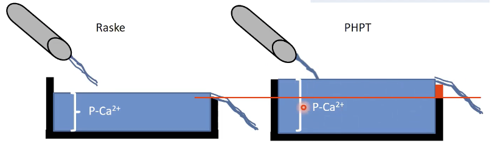
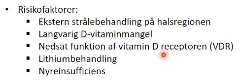
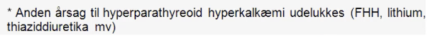

# Primær hyperparathyroidisme
## Generelt

[[Primær hyperparathyroidisme]] skyldes altså primært manglende udskillelse af Ca2+ (en forhøjet kant på badekarret).

## Differentialdiagnose
Q. Hvad er de to primære undertyper af [[Primær hyperparathyroidisme]]?
A. 1) Solitært adenom (90%), 2) Diffus hyperplasi (10%)

Q. Hvad er den nærmest eneste differentialdiagnose til [[Primær hyperparathyroidisme]]?
A. [[Familiær hypocalciurisk hypercalcæmi (FHH)]]

Typisk uafklaret

OBS dog [[MEN1]], [[MEN2A]].

## Udredning
### Anamnese

### Objektiv us.

### Paraklinik
Q. Hvordan diagnosticeres [[Primær hyperparathyroidisme]]?
A. 2 prøver med både 1) *forhøjet* [[PTH]] og 2) forhøjet [[p-Ca]]

Q. Din patient har fået biokemisk diagnosticeret [[Primær hyperparathyroidisme]]. Hvad tilføjes til paraklinikken mhp. videre udredning?
A.  Lokalisation: 1) Skintigrafi, 2) UL-hals. Hjerte: 1) [[EKG]]. Nyre: 1) CT tomscanning af nyrer (sten, afløbshindring). Knogler: 1) DEXA, 2) Rtg. thoracolumbalis.

## Behandling
Q. Du mistænker i AP at din patient fejler [[Primær hyperparathyroidisme]]. Hvad nu?
A. Henvisning til endokrinolog

Q. Din patient har [[Primær hyperparathyroidisme]]. Hvad vil du spørge til og undersøge for at finde ud af, om han skal behandles?
A. Taler for beh: 1) [[Hypertension]], 2) [[EKG]]-forstyrrelser, 3) Galde- eller nyresten, 4) [[Osteoporose]], 5) Svært forhøjet calcium

Q. Hvordan behandles [[Primær hyperparathyroidisme]]?
A. Typisk fjernelse af mindst 1 af kirtlerne

## Opfølgning

## Prognose

<!-- #anki/tag/med/Endocrinology #anki/deck/Medicine -->

## Backlinks
* [[PTH]]
	* Q. Hvad er de primære årsager til forøget [[PTH]]?
* [[Primær hyperparathyroidisme]]
	* [[Primær hyperparathyroidisme]] skyldes altså primært manglende udskillelse af Ca2+ (en forhøjet kant på badekarret).
	* Q. Hvad er de to primære undertyper af [[Primær hyperparathyroidisme]]?
	* Q. Hvad er den nærmest eneste differentialdiagnose til [[Primær hyperparathyroidisme]]?
	* Q. Hvordan diagnosticeres [[Primær hyperparathyroidisme]]?
	* Q. Din patient har fået biokemisk diagnosticeret [[Primær hyperparathyroidisme]]. Hvad tilføjes til paraklinikken mhp. videre udredning?
	* Q. Du mistænker i AP at din patient fejler [[Primær hyperparathyroidisme]]. Hvad nu?
	* Q. Din patient har [[Primær hyperparathyroidisme]]. Hvad vil du spørge til og undersøge for at finde ud af, om han skal behandles?
	* Q. Hvordan behandles [[Primær hyperparathyroidisme]]?
* [[Hyperparathyroidisme]]
	* [[Primær hyperparathyroidisme]]
[[Tertiær hyperparathyroidisme]]

<!-- {BearID:2470641A-07AB-4B60-AEA4-38413ADDB2AA-43570-00005BAC06425A3F} -->
