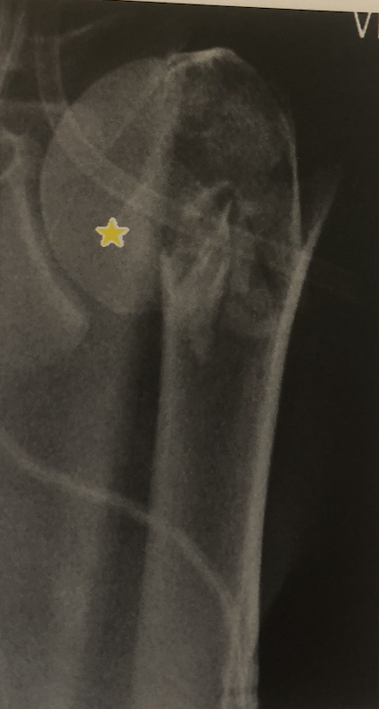
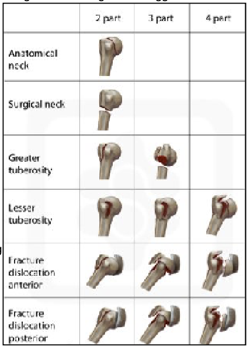

# Proksimal humerusfraktur
## Generelt
Opdeles ad modum Neer ([[Neers klassifikation]]).
## Differentialdiagnose
Q. Hvad ses her?

A. Valgus-fejlstillet [[Proksimal humerusfraktur]] (isvaffel)

Q. Hvad ses her?

A. A. Varus-fejlstillet [[Proksimal humerusfraktur]]

Q. Hvilke muskelinsertioner er typisk påvirket ved [[Proksimal humerusfraktur]]?
A. [[Rotator cuffen]]: Teres minor, infraspinatus, supraspinatus, subscapularis

## Udredning
### Anamnese
Q. Hvad er den typiske anamnese ved [[Proksimal humerusfraktur]]?
A. Fald på strakt arm.

### Objektiv us.

### Paraklinik

## Behandling

Q. Hvilke kriterier indicerer operativ behandling af en [[Proksimal humerusfraktur]]?
A. 1) Dislocering mere end 1 cm *eller* 2) Vinkling mere end 45 grade.

Q. Hvordan behandles en ikke-displaceret [[Proksimal humerusfraktur]]?
A. Mitella i 1-2 uger. Rtg. kontrol og begynde forsigtig mobilisering her.

Q. Hvordan behandles en collum anatomicum?
A. Hemi-alloplastik, obs [[Avaskulær nekrose]].

Q. Hvilke typer [[Proksimal humerusfraktur]] forsøger vi at reponere?
A. 2- og 3-fragmenttyperne.

Q. Hvordan behandles en disloceret 2- og 3-fragment [[Proksimal humerusfraktur]]?
A. God knoglekvalitet: Osteosyntese. Dårlig knoglekvalitet, alloplastik.

Q. Hvordan behandles en disloceret 4-fragment [[Proksimal humerusfraktur]]?
A. Hemialloplastik og bløddelsrekonstruktion

## Opfølgning
Q. Hvor lang tid kan forventes genoptræning efter en [[Proksimal humerusfraktur]]?
A. 3-6 mdr.

## Prognose
Q. Hvad er prognosen for en varus-fejlstillet [[Proksimal humerusfraktur]]?
A. Dårlig, OBS: [[Avaskulær nekrose]]

## Backlinks
* [[Rotator cuff læsion]]
	* Q. Hvilke *traumatiske* differentialdiagnoser er der til [[Rotator cuff læsion]]?
* [[Proksimal humerusfraktur]]
	* Q. Hvad ses her?
A. Valgus-fejlstillet [[Proksimal humerusfraktur]] (isvaffel)
	* Q. Hvad ses her?
A. A. Varus-fejlstillet [[Proksimal humerusfraktur]]
	* Q. Hvilke muskelinsertioner er typisk påvirket ved [[Proksimal humerusfraktur]]?
	* Q. Hvad er den typiske anamnese ved [[Proksimal humerusfraktur]]?
	* Q. Hvilke kriterier indicerer operativ behandling af en [[Proksimal humerusfraktur]]?
	* Q. Hvordan behandles en ikke-displaceret [[Proksimal humerusfraktur]]?
	* Q. Hvilke typer [[Proksimal humerusfraktur]] forsøger vi at reponere?
	* Q. Hvordan behandles en disloceret 2- og 3-fragment [[Proksimal humerusfraktur]]?
	* Q. Hvordan behandles en disloceret 4-fragment [[Proksimal humerusfraktur]]?
	* Q. Hvor lang tid kan forventes genoptræning efter en [[Proksimal humerusfraktur]]?
	* Q. Hvad er prognosen for en varus-fejlstillet [[Proksimal humerusfraktur]]?
* [[§Overarm]]
	* [[Proksimal humerusfraktur]]

<!-- #anki/tag/med/Orto #anki/deck/Medicine -->

<!-- {BearID:F9B21A66-F9D4-4E3E-8D36-3E611EF68F8D-62499-00008445EC24DCEA} -->
