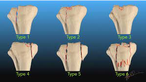

# Proksimal tibiafraktur
## Generelt
Inddeles ad modum Schatzker.

*CT*

Fald med aksial rotation.

## Differentialdiagnose

## Udredning
### Anamnese

### Objektiv us.

### Paraklinik

## Behandling

## Opfølgning

## Prognose
 

## Backlinks
* [[Tibia]]
	* [[Proksimal tibiafraktur]]

<!-- #anki/tag/med/Orto #anki/deck/Medicine -->

<!-- {BearID:040B3173-FAA7-4156-A4E7-3777363D7092-21052-000044CABF497C14} -->
