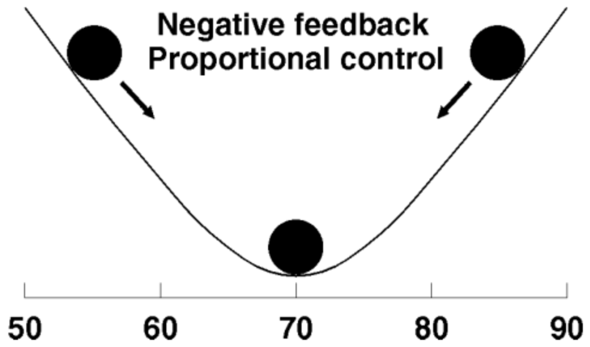

# Proportional control stabilizes systems

As a contrast to bang-bang control. It's turning up the heat a little bit if it's a little cold, or a lot if it's very cold.

## Backlinks
* [[Systems should guide towards the desired state]]
	* Ideally with proportional control, since [[Proportional control stabilizes systems]]. However, beware that you stabilise the right thing! Sometimes systems need to be flexible so attain stability in other areas, eg. work hours are flexible to attain psychological stability. 
* [[§Systems Thinking]]
	* [[Proportional control stabilizes systems]]

<!-- #p1 -->

<!-- {BearID:3673D334-FB5F-4C61-892B-D7D3F8314BFA-501-00000053D9A461D4} -->
