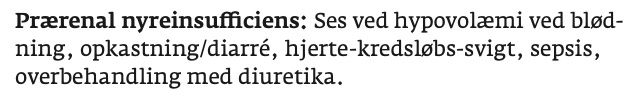
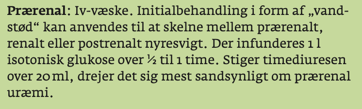

# Prærenalt nyresvigt
## Generelt

## Differentialdiagnose

## Udredning
### Anamnese

### Objektiv us.

### Paraklinik

## Behandling

## Opfølgning

## Prognose
 

## Backlinks
* [[Akut nyresvigt (AKI)]]
	* [[Prærenalt nyresvigt]]
[[Postrenalt nyresvigt]]

<!-- #anki/deck/Medicine# #anki/tag/med/Nephrology -->

<!-- {BearID:FAB46478-9712-4F2E-839D-52E59FD23297-15714-000035C73B6C1AE6} -->
