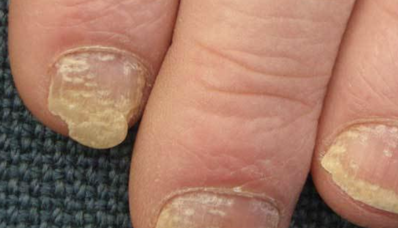

# Psoriasis i negle
Q. Beskriv morfologien ved neglepsoriasis
A. 1) Fingerbølsdeformiteter, 2) Distal [[Onykolyse]] og 3) Rødgule pletter i neglelejet (oliepletter)

Q. Hvad ses her?

A. [[Neglepsoriasis]]

## Backlinks
* [[Psoriasis]]
	* Typer:
		[[Nummulat psoriasis vulgaris]]
		[[Plaque psoriasis vulgaris]]
		[[Guttat psoriasis vulgaris]]
		[[Intertriginøs psoriasis vulgaris]]
	[[Psoriasis pustulosa]]
		[[Pustulosis palmoplantaris]]
		[[Acrodermatitis continua Hallopeau]]
	[[Psoriasis i negle]]
	[[Psoriasisartrit]]
	[[Psoriasis erytroderma]]

<!-- #anki/tag/med/Derma #anki/deck/Medicine -->

<!-- {BearID:2ED4EF2D-ACAF-42FD-A4D2-0F567F40F779-959-000005B411361105} -->
