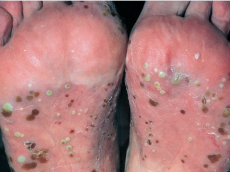

# Pustulosis palmoplantaris
Q. Hvad ses her?

A. [[Pustulosis palmoplantaris]]

Skældannelse. Tæt associeret til [[Psoriasis]].

## Backlinks
* [[Psoriasis]]
	* Typer:
		[[Nummulat psoriasis vulgaris]]
		[[Plaque psoriasis vulgaris]]
		[[Guttat psoriasis vulgaris]]
		[[Intertriginøs psoriasis vulgaris]]
	[[Psoriasis pustulosa]]
		[[Pustulosis palmoplantaris]]
		[[Acrodermatitis continua Hallopeau]]
	[[Psoriasis i negle]]
	[[Psoriasisartrit]]
	[[Psoriasis erytroderma]]
* [[Pustulosis palmoplantaris]]
	* Q. Hvad ses her?
A. [[Pustulosis palmoplantaris]]

<!-- #anki/tag/med/Derma #anki/deck/Medicine -->

<!-- {BearID:8E879DD8-E46D-4BE9-B3E5-50990DA81302-959-000006FC64EC3DBE} -->
