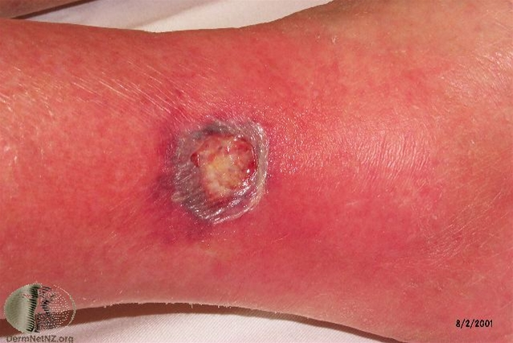
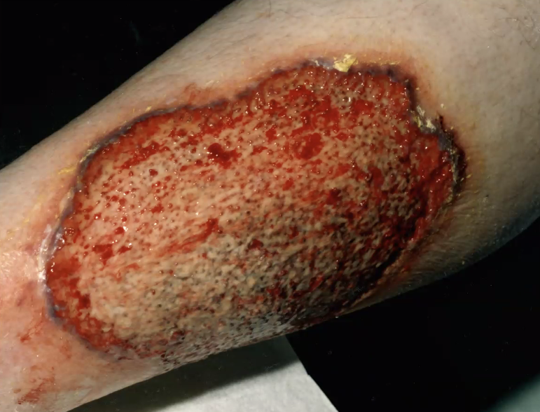

# Pyoderma gangraenosum
## Generelt
Sjælden sygdom med pludseligt opstået, stort sår.

## Differentialdiagnose
Differentialdiagnostisk bør udelukkes [[Nekrotiserende fasciitis]].

Q. Hvordan adskilles [[Iskæmiske bensår]] fra [[Pyoderma gangrenosum]]?
A. [[Pyoderma gangrenosum]] S) Stort, O) pludseligt opstået og A) Typisk solitært

## Udredning
### Anamnese

### Objektiv us.
Q. Beskriv – Diagnose(r)?

A. Solitært sår med fibrin centralt, perifær underminering - [[Pyoderma gangraenosum]]

Q. Beskriv – Diagnose(r)?

A. Solitært sår med fibrin centralt, perifær underminering - [[Pyoderma gangraenosum]]

### Paraklinik

## Behandling
Q. Hvordan behandles [[Pyoderma gangraenosum]]?
A. 1) Systemisk cyklosporin, 2) Kompression for ødem, 3) Sårrensning (fjernelse af fibrin). Kirurgisk recision er kontraindiceret, kirurgisk traume kan forværre sygdommen.

## Opfølgning

## Prognose

<!-- #anki/deck/Medicine #anki/tag/med/Derma -->
## Backlinks
* [[Bensår]]
	* Q. Hvilke immunologiske bensår findes?
	* Q. Hvilke *autoimmune* differentialdiagnoser findes til [[Bensår]]?
* [[Pyoderma gangraenosum]]
	* Q. Beskriv – Diagnose(r)?
A. Solitært sår med fibrin centralt, perifær underminering - [[Pyoderma gangraenosum]]
	* Q. Beskriv – Diagnose(r)?
A. Solitært sår med fibrin centralt, perifær underminering - [[Pyoderma gangraenosum]]
	* Q. Hvordan behandles [[Pyoderma gangraenosum]]?
	* [[Pyoderma gangraenosum]]
	* Q. Beskriv – Diagnose(r)?
	* Q. Beskriv – Diagnose(r)?
	* Q. Hvordan behandles [[Pyoderma gangraenosum]]?

## Backlinks
* [[Pyoderma gangraenosum]]
	* Q. Beskriv – Diagnose(r)?
A. Solitært sår med fibrin centralt, perifær underminering - [[Pyoderma gangraenosum]]
	* Q. Beskriv – Diagnose(r)?
A. Solitært sår med fibrin centralt, perifær underminering - [[Pyoderma gangraenosum]]
	* Q. Hvordan behandles [[Pyoderma gangraenosum]]?
* [[Bensår]]
	* Q. Hvilke immunologiske bensår findes?
	* Q. Hvilke *autoimmune* differentialdiagnoser findes til [[Bensår]]?

<!-- {BearID:E138384C-F353-4478-9A42-907FD3C32B71-21842-00003BB943BD8426} -->
