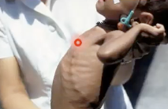
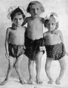

# Rakitis
## Generelt
Q. Hvad er relationen mellem [[Rakitis]] og [[Osteomalaci]]?
A. [[Rakitis]] er [[Osteomalaci]] i børn.

Q. Hvad menes i sundhedsvæsenet med *[[Rakitis]]*? 
A. *Nedsat mineralisering pga. mangel af D-vitamin i børn*

Q. Hvad hedder *Nedsat mineralisering pga. mangel af D-vitamin i børn* i sundhedsvæsenet? 
A. *[[Rakitis]]* 

## Differentialdiagnose

## Udredning
### Anamnese

### Objektiv us.
Q. Du mistænker din patient har [[Rakitis]]. Hvilke kliniske fund vil man se?
1) Stor pande, 2) Rakitisk rosenkrans, 3) Genu valgum/varum

### Paraklinik
1. Blodprøver
2. U-stix (OBS: Fanconis)
3. Røntgen håndled

## Behandling

## Opfølgning

## Prognose

## Backlinks
* [[Rakitis]]
	* Q. Hvad er relationen mellem [[Rakitis]] og [[Osteomalaci]]?
	* Q. Hvad er relationen mellem [[Rakitis]] og [[Osteomalaci]]?
	* Q. Hvad menes i sundhedsvæsenet med *[[Rakitis]]*? 
	* Q. Hvad hedder *Nedsat mineralisering pga. mangel af D-vitamin i børn* i sundhedsvæsenet? 
	* Q. Du mistænker din patient har [[Rakitis]]. Hvilke kliniske fund vil man se?

<!-- #anki/tag/med/Endocrinology #anki/deck/Medicine -->

<!-- {BearID:A06B5D01-580B-4BD2-9C0F-DBE5172819B5-23388-00003DFFC0DAC963} -->
