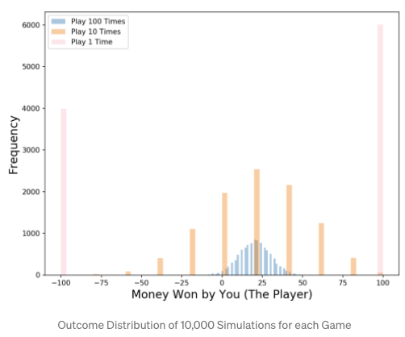

# Random forest
Q. How does a decision tree in a random forest differ from a naive decision tree?
A. It has only a subset of features available for node splitting

Q. Why do we restrict the available features for each tree in a random forest?
A. To decrease correlation between trees

Q. Why do we want trees in a random forest to have low correlation?
A. It decreases bias of aggregate predictions – if trees are wrong in different ways, they bias-correct each other.

Q. What is the algorithm for training a single tree in a random forest?
A. Select subset of features. Then select the feature that best distinguishes categories for node splitting. Repeat until out of features.

Q. What is the pipeline of a random forest?
A. Create N random samples with replacement, train a decision tree on each sample while restricting the features available for splitting nodes, then use the average prediction as your aggregate prediction

Q. Why is a random forest favourable compared to a single tree?
A. Decreased variance of predictions due to lack of correlation between trees:

<!-- #anki/deck/ML# -->

## Backlinks
* [[Decision tree learning]]
	* [[Random forest]].
* [[§Machine Learning]]
	* [[Random forest]]

<!-- {BearID:26286925-767B-4B04-A262-E1D63EF5915C-4241-00000794EED18CD3} -->
