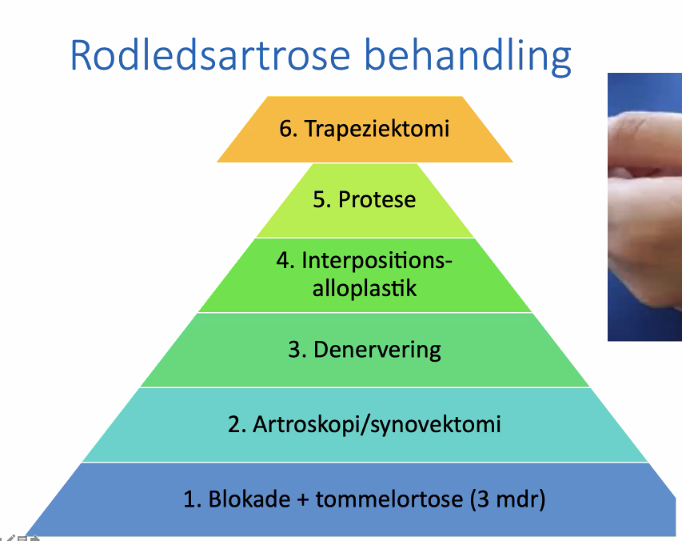

# Rodledsartrose
## Generelt
En [[Fingerartrose]] i tommelfingerens grundled.

## Differentialdiagnose

## Udredning
### Anamnese

### Objektiv us.
Q. Din patient viser symptomer på [[Rodledsartrose]]. Hvad vil du tilføje *den objektive us.*? 
A. 1) Inspektion, 2) Palpation for: Hævelse, smertelokalisation (over tommelens rodled), 3) Funktion: Sensibilitet, aktiv- og passiv mobilitet, [[Grinding test]]

### Paraklinik
Q. Din patient viser symptomer på [[Rodledsartrose]]. Hvad vil du tilføje til *paraklinikken*? 
A. Rtg.

## Behandling

Ortose er en aflastende skinne. Derudover NSAID/paracetamol. Aflastning af specifikke aktiviteter.

Step 1 skal bruges 3 mdr. før der anbefales kirurgi. 2. virker kun hos meget unge med slidgigt. 3. fungerer dårligt. Grundlæggende kun 1, 2, 5 og 6.

Der går ca. 1 år før man har fuld effekt af Trapeziektomi.

## Opfølgning

## Prognose

<!-- #anki/tag/med/Orto #anki/deck/Medicine -->

## Backlinks
* [[Rodledsartrose]]
	* Q. Din patient viser symptomer på [[Rodledsartrose]]. Hvad vil du tilføje *den objektive us.*? 
	* Q. Din patient viser symptomer på [[Rodledsartrose]]. Hvad vil du tilføje til *paraklinikken*? 
* [[Grinding test]]
	* Q. Hvad tester en *[[Grinding test]]* for?
	* Q. Hvilken test kan bruges til at teste for *[[Rodledsartrose]]* i tommel?
* [[Fingerartrose]]
	* [[Rodledsartrose]]
* [[Mb. de Quervain]]
	* Q. Hvad er differentialdiagnoserne til [[Morbus de Quervain]]?
* [[Tommelfingersmerter]]
	* [[Mb. de Quervain]]
* [[Radiale håndledssmerter]]
	* [[Scaphoideumfraktur]]
[[Mb. de Quervain]]
* [[Rtg. håndled]]
	* Q. Hvad ses her?
A. [[Rodledsartrose]] - ledspalteafsmalning, osteofytter, subluksation.

<!-- {BearID:AFB20432-F3AF-4CF9-BD60-DCF37FE84158-20983-00002422CF29207A} -->
