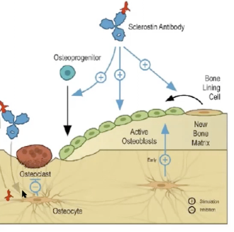

# Romosozumab
Q. Hvordan fungerer [[Romosozumab]]?
A. [[Sclerostin]]-hæmmer.

## Backlinks
* [[Osteoporose]]
	* [[Romosozumab]]
	* Q. Nævn et eksempel på knogleanabol behandling af [[Osteoporose]].
* [[Romosozumab]]
	* Q. Hvordan fungerer [[Romosozumab]]?

<!-- #anki/tag/med/Endocrinology #anki/deck/Medicine #anki/tag/med/Pharmacology -->

<!-- {BearID:6F875A6C-784D-488B-A187-4E40FC819E6B-83502-00005D2A9FCA6B44} -->
