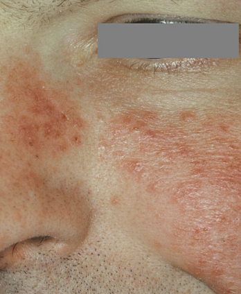
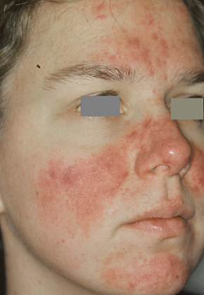
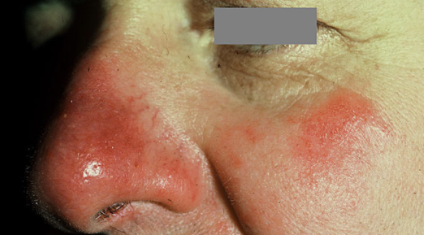

# Rosacea
## Generelt
Q. Beskriv eksantemet – Diagnose(r)?

A. Papulopustuløst erytem uden komedomer med rhinophyma - [[Rosacea]]

Q. Beskriv eksantemet – Diagnose(r)?

A. Papulopustuløst erytem uden komedomer  - [[Rosacea]]

Q. Beskriv eksantemet – Diagnose(r)?

A. Erytem og telangieektasier i ansigt med rhinophyma - [[Rosacea]]

Q. Beskriv eksantemet – Diagnose(r)?

A. Multiple erytematøse papler og enkelte pustler. Uden komedomer, med rhinophyma - [[Rosacea]]

## Differentialdiagnose
Polymorft lysudslæt
[[Seboroisk dermatitis]]
[[Perioral dermatitis]]
[[Lupus erythematosus]]
[[Sarkoidose]]

## Udredning
### Anamnese
Q. Beskriv *S* OCRATES for [[Rosacea]] 
A. Centralt i ansigtet

Q. Beskriv SO *C* RATES for [[Rosacea]] 
A. Erytem, telangieektasier, (papler og pustler)

Q. Beskriv SOCR *A* TES for [[Rosacea]] 
A. [[Conjunctivitis]] eller andre øjensymptomer

Q. Beskriv SOCRAT *E* S for [[Rosacea]] 
A. Flushing af stress, alkohol eller varme

### Objektiv us.
Keratit.

### Paraklinik

## Behandling
Q. Hvordan behandles telangieektasier ved [[Rosacea]]?
A. Laser (permanent) eller a2-agonist (midlertidigt)

Q. Hvordan behandles pustler ved [[Rosacea]]?
A. 1) Metronidazolcreme, evt. systemisk [[Tetracyklin]], 2) Kan optrappes til [[Retinoider]] (OBS: Undgå steroid, kan forværre!)

## Opfølgning

## Prognose

## Backlinks
* [[Testosteron]]
	* Q. En patient vil i behandling med [[Testosteron]] på god indikation. Hvilke kontraindikationer kan stoppe beh.? 
* [[Rosacea]]
	* Q. Beskriv eksantemet – Diagnose(r)?
A. Papulopustuløst erytem uden komedomer med rhinophyma - [[Rosacea]]
	* Q. Beskriv eksantemet – Diagnose(r)?
A. Papulopustuløst erytem uden komedomer  - [[Rosacea]]
	* Q. Beskriv eksantemet – Diagnose(r)?
A. Erytem og telangieektasier i ansigt med rhinophyma - [[Rosacea]]
	* Q. Beskriv eksantemet – Diagnose(r)?
A. Multiple erytematøse papler og enkelte pustler. Uden komedomer, med rhinophyma - [[Rosacea]]
	* Q. Beskriv *S* OCRATES for [[Rosacea]] 
	* Q. Beskriv SO *C* RATES for [[Rosacea]] 
	* Q. Beskriv SOCR *A* TES for [[Rosacea]] 
	* Q. Beskriv SOCRAT *E* S for [[Rosacea]] 
	* Q. Hvordan behandles telangieektasier ved [[Rosacea]]?
	* Q. Hvordan behandles pustler ved [[Rosacea]]?
* [[Urge-inkontinens]]
	* [[Rosacea]]
* [[Akne]]
	* Q. Hvordan adskilles [[Akne]] fra [[Rosacea]]?
	* Q. Hvordan adskilles [[Akne]] fra [[Rosacea]]?

<!-- #anki/tag/med/Derma #anki/deck/Medicine -->

<!-- {BearID:462897C2-CF66-4F30-A221-979F52786784-6575-0000073F6B640D89} -->
