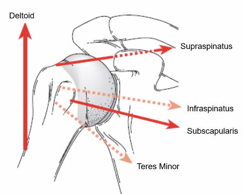
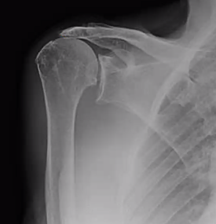

# Rotator cuff læsion
## Generelt
[[Akut rotator cuff læsion]], kræver stort traume. Den akutte skal undersøges indenfor uger på orto. Sjældent, højenergitraumer. 

[[Kronisk rotator cuff læsion]], opstår ved et meget lille traume og fortsætter. Da de resterende fibre nu har yderligere belastninger kommer der gradvist flere og flere små læsioner. Typisk *ældre*. 

Q. Hvilken aldersgruppe får [[Rotator cuff læsion]]?
A. Stort set kun ældre, yngre får hyppigere fraktur eller ledlæbelæsion.

Q. Hvordan adskiller anamnesen ved [[Akut rotator cuff læsion]] sig fra [[Kronisk rotator cuff læsion]]?
A. [[Akut rotator cuff læsion]] har større traume og typisk akut tab i kraft.

Sandsynlighed for læsion: (Høj -> Lav)
Supraspinatus
Infraspinatus
Subscapularis
Teres minor

## Differentialdiagnose
Q. Hvilke *traumatiske* differentialdiagnoser er der til [[Rotator cuff læsion]]?
A. [[Skulderluksation]], [[Proksimal humerusfraktur]] eller nerverodsentrapment.

## Udredning
### Anamnese
Q. Hvilke symptomer bør lede til mistanke om rotator-cuff læsion?
A. Smerter i overarm/deltoideus, ukarakteristiske dysæstesier, nedsat kraft, kan ikke løfte arm over hovedet

### Objektiv us.
Q. Hvad indgår i inspektionen ved OBS [[Rotator cuff læsion]]?
A. Atrofi af deltoideus (sideforskel?). Sæt finger på spina: Er der atrofi af supra- eller infraspinatus?

Q. Hvilke funktioner skal testes ved OBS [[Rotator cuff læsion]]?
A. [[Lift-off test]], abduktion, udadrotation

Q. Hvad menes med [[Lag-signs]] ved skulderundersøgelse?
A. Armen placeres i “normal”-positionen for en given test, men patienten kan ikke holde den der

Q. Hvilken undersøgelse har højest PPV for rotator-cuf læsion?
A. [[Lag-signs]]

Q. En patient har nedsat aktiv abduktion af skulder, men normal passiv abduktion. Hvad tyder det på?
A. [[Rotator cuff læsion]]

Q. En patient har nedsat kraft, nok pga. smerter. Hvad nu?
A. Pres patienten – hvis de kan presse symmetrisk, er der ikke nedsat kraft. Hvis nedsat kraft skal de udredes for årsag (eg. MR).

Q. Hvad ses her?

A. Stor rotator-cuff læsion, deltoideus trækker leddet superiort.

### Paraklinik
Afhænger af akut/kronisk.

## Behandling
Afhænger af akut/kronisk.

## Opfølgning
Afhænger af akut/kronisk.

## Prognose
Afhænger af akut/kronisk.

## Backlinks
* [[Rotator cuff læsion]]
	* Q. Hvilken aldersgruppe får [[Rotator cuff læsion]]?
	* Q. Hvilke *traumatiske* differentialdiagnoser er der til [[Rotator cuff læsion]]?
	* Q. Hvad indgår i inspektionen ved OBS [[Rotator cuff læsion]]?
	* Q. Hvilke funktioner skal testes ved OBS [[Rotator cuff læsion]]?
	* Q. En patient har nedsat aktiv abduktion af skulder, men normal passiv abduktion. Hvad tyder det på?
* [[§Skulderen]]
	* [[Degenerative skulderlidelser]]
* [[Skulderluksation]]
	* [[Superior skulderinstabilitet]] ([[Rotator cuff læsion]]).
* [[Akut rotator cuff læsion]]
	* Q. Hvordan arrangeres behandling af en akut [[Rotator cuff læsion]] i AP?
	* Q. Under hvilke omstændigheder opereres en *akut* [[Rotator cuff læsion]]?
* [[Subacromialt impingement syndrom]]
	* Q. Hvordan adskilles [[Subacromialt impingement syndrom]] fra [[Rotator cuff læsion]]?
* [[Kronisk rotator cuff læsion]]
	* Q. Under hvilke omstændigheder opereres en *kronisk* [[Rotator cuff læsion]]?
	* Q. Hvordan arrangeres behandling af en kronisk [[Rotator cuff læsion]] i AP?
* [[Degenerative skulderlidelser]]
	* [[§Rotator cuff]]
* [[§Rotator cuff]]
	* [[Rotator cuff læsion]]

<!-- #anki/tag/med/Orto #anki/deck/Medicine -->

<!-- {BearID:578BBE31-EA4C-42E7-8084-A2242D5FC39B-9395-000024D4AD57388D} -->
