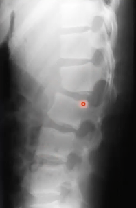

# Rtg. af ryg
Q. Hvilke elementer indgår i gennemgang af et traumertg. af ryg?
A. Alignment, Bone, Cartilage, Derma (bløddele)

Q. Din patient kommer ind med et fald, OBS rygtraume. Hvilken ortopædkirurgisk paraklinik vil du gerne have?
A. Rtg. columna (*BÅDE* thorakalt og lumbalt)

Q. Hvad er forklaringen på den kantede form infero-anteriort på corpora?

A. Rand-listen, “epifyseskive” for corpora

## Generelt

## Differentialdiagnose

## Udredning
### Anamnese

### Objektiv us.

### Paraklinik

## Behandling

## Opfølgning

## Prognose
 

<!-- #anki/tag/med/Orto #anki/deck/Medicine -->

<!-- {BearID:5933B5F7-C0A6-40AF-AC30-6F564E9F5599-20440-00003016AD68CCB2} -->
