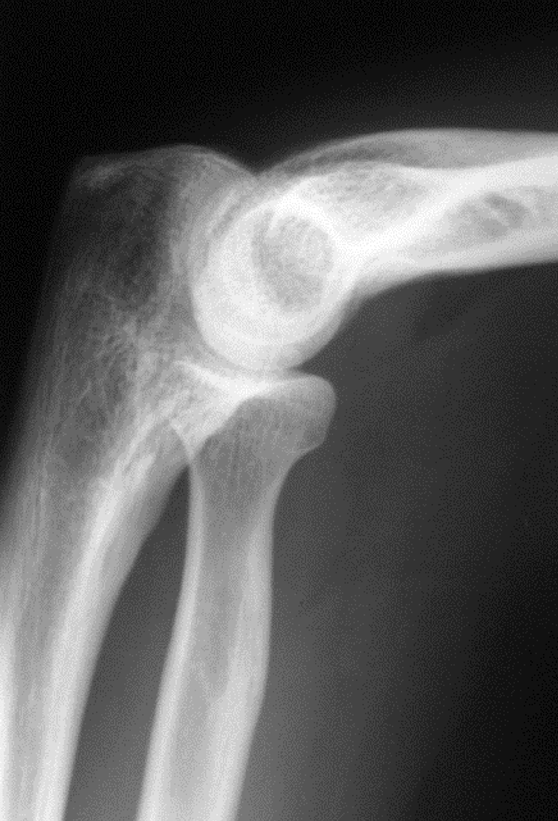
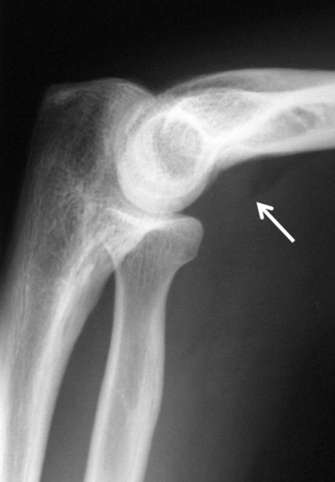
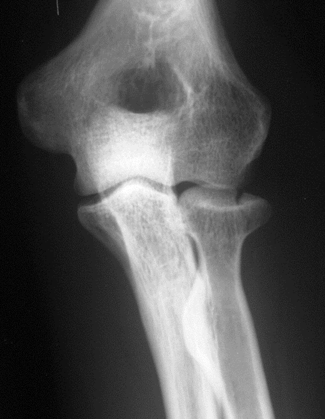
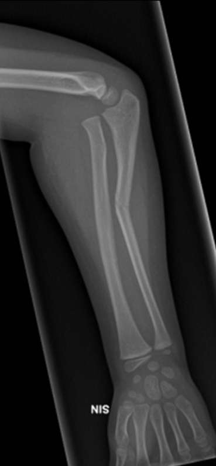

# Rtg. albue
Q. Hvad ses her?

A. Fedtpudetegn, OBS fraktur

Q. Hvad ses her?

A. [[Caput radii fraktur]]

Q. Hvad ses her?

A. Green-stick fraktur med [[Monteggia fraktur-dislokation]] – OBS hvis kun en underarmsknogle er brækket, *skal* der være dislokation

<!-- #anki/tag/med/Radiology #anki/deck/Medicine -->

<!-- {BearID:D593E5DA-5F7F-4ED9-BB5D-3BB48C9F6F00-2900-0000043546A683B0} -->
