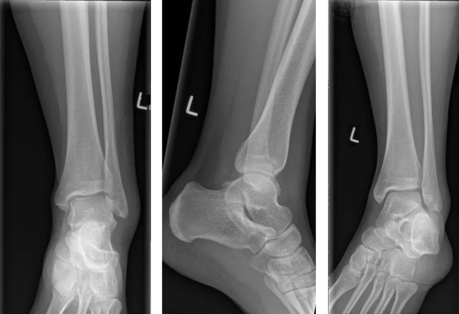

# Rtg. ankel
Q. Du ser på rtg. af en truamatisk ankel. Hvad bør du kigge efter?

A. 1) Tibia og fibula i deres helhed, 2) Symmetri talocruralt (OBS ligamentlæsion), 3) Gennemse fodknogler.

## Backlinks
* [[Pilonfraktur]]
	* Q. En patient mistænkes i skadestuen for [[Pilonfraktur]]. Hvad gøres?

<!-- #anki/tag/med/Orto #anki/deck/Medicine -->

<!-- {BearID:B1E081A9-A43B-4169-B8DD-6174DC5FFDC0-2960-00000B512F9A768F} -->
