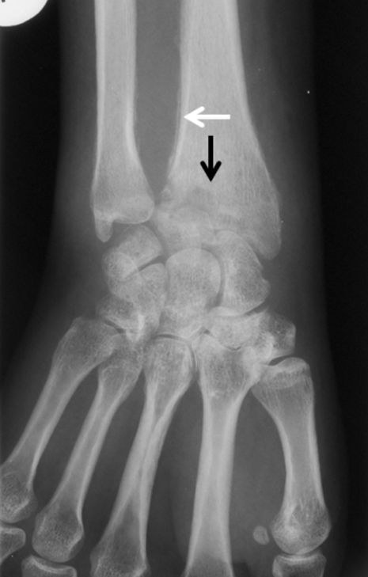
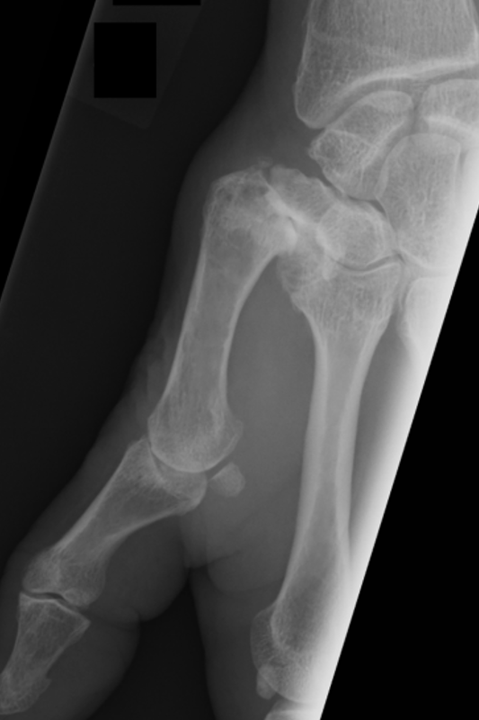

# Rtg. håndled
Q. Hvad ses her?

A. Artrit + periostal reaktion

Q. Hvad ses her?

A. [[Rodledsartrose]] - ledspalteafsmalning, osteofytter, subluksation.

<!-- #anki/deck/Medicine #anki/tag/med/Radiology -->

<!-- {BearID:7FD9B9E2-938F-40DC-85CC-0ABC6314AAB4-80814-0001215FF1F92C31} -->
