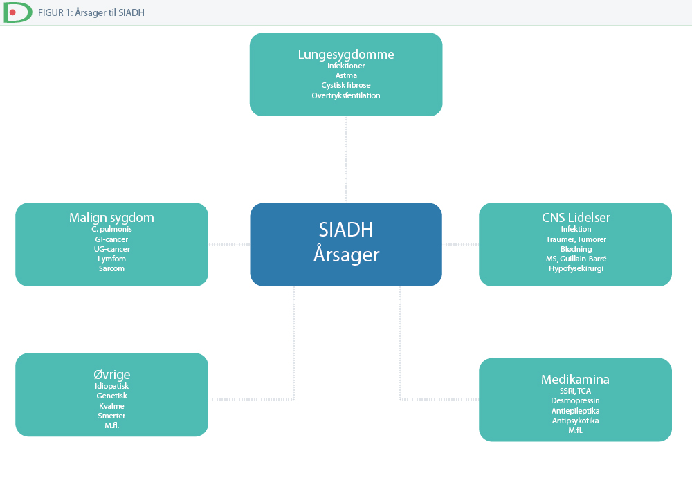

# SIADH
## Generelt
De diagnostiske kriterier for SIADH er:
1. Ingen ødem
2. Ingen klinisk dehydrering
3. Normal thyroidea-, binyre- og nyrefunktion
4. U-osmolalitet > 100 mosmol/kg
5. U-Na > 30 mmol/l

Q. Hvorfor giver SIADH [[§Hyponatriæmi]]?
A. Fortynding pga. væskeretention

## Differentialdiagnose

Q. Hvad er de overordnede årsager til [[SIADH]]?
A. 1) CNS-lidelser, 2) Lungesygdom, 3) Malign sygdom, 4) Medikamina

## Udredning
### Anamnese

### Objektiv us.

### Paraklinik

## Behandling

## Opfølgning

## Prognose

QD. Hvilke parakliniske undersøgelser leder til diagnose af [[SIADH]]?
A. 1) U-Na og 2) U-Osmolalitet

## Backlinks
* [[SIADH]]
	* Q. Hvad er de overordnede årsager til [[SIADH]]?
	* QD. Hvilke parakliniske undersøgelser leder til diagnose af [[SIADH]]?
* [[§Hyponatriæmi]]
	* Q. Hvad er de primære årsager til [[Normohydreret hyponatriæmi]]?
* [[ADH]]
	* Q. Hvilken sygdom leder *hyper*sekretion af [[ADH]] til? 
* [[Normohydreret hyponatriæmi]]
	* Q. Din patient har [[Normohydreret hyponatriæmi]]. Hvad vil du tilføje til paraklinikken?
* [[§Fald]]
	* [[SIADH]]

<!-- #anki/tag/med/Endocrinology #anki/deck/Medicine -->

<!-- {BearID:8D70AD51-35C6-4504-8933-ECE370F58C5D-966-00001691E49F0982} -->
