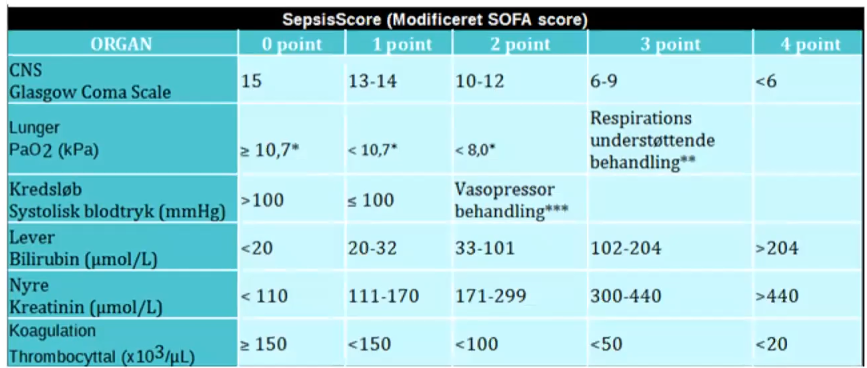
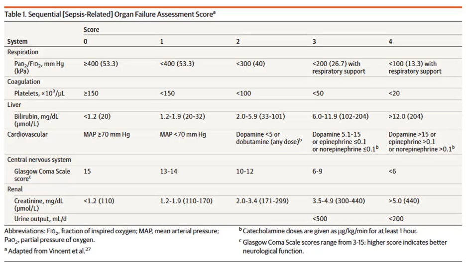

# SOFA
## Generelt
*I reg. midt, modificeret version* 

*Internationalt*

## Backlinks
* [[Sepsis]]
	* Q. Hvordan defineres [[Sepsis]] diagnostisk?
	* Hvis [[qSOFA]] &lt; 2 eller [[SOFA]] &lt; 2, [[Simpel infektion]].

<!-- #anki/tag/med/Infectious #anki/deck/Medicine -->

<!-- {BearID:436EBBFB-9072-4320-BB07-1941F011BFE8-41270-000043F2CFD8126D} -->
