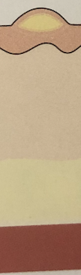

# SSSS
Staphylococus scalded skin syndrome.

Q. Hvilken type infektion ses her?

A. [[SSSS]]/Bulløs impetigo

## Backlinks
* [[SSSS]]
	* Q. Hvilken type infektion ses her?
A. [[SSSS]]/Bulløs impetigo
* [[Infektioner i huden]]
	* [[S. aureus]]
	[[SSSS]]
	[[Erysipelas]]
	[[Ektyma]]
	[[Follikulitis]]
		[[Furunkel]]
			[[Karbunkel]]
	[[Cellulitis]]
	[[Nekrotiserende fasciitis]]

<!-- #anki/tag/med/Derma #anki/deck/Medicine #anki/tag/med/Infectious -->

<!-- {BearID:D5F57A48-7E78-4A32-A0E8-6E3A608FCDBE-43570-00005121CEF2A072} -->
