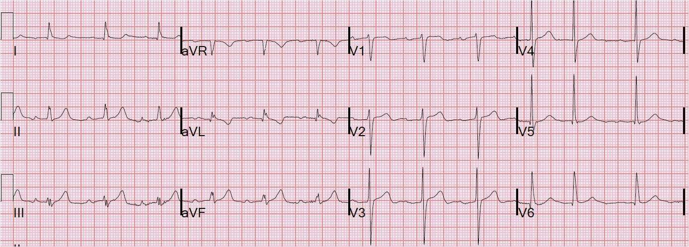

# STEMI
* Udbredte ST-depressioner
* Nyopstået [[Venstresidigt grenblok (LBBB)]]
* Nyopstået [[Højresidigt grenblok (RBBB)]]
* [[Posteriort STEMI]]

Andre tegn:
* [[Wellens t-tak]]
Bifasisk T-tak: Først positiv så negativ eller en dyb inverteret T-tak

* [[De Winters forandringer]]
En op-adforløbende ST-depression >1 mm samt høje T-takker, typiske i præcordiale afledninger (v1-v6)).

* [[Hyperakutte T-takker]] (abnormt høje, evt. let spidse T-takker).

## Backlinks
* [[Akut koronart syndrom (AKS)]]
	* [[STEMI]]

<!-- #anki/tag/med/Cardiology #anki/deck/Medicine #anki/tag/med/GP -->

<!-- {BearID:E2446546-1676-4A67-9AC6-426F3F6BA6B5-3083-00000FCC068576B7} -->
