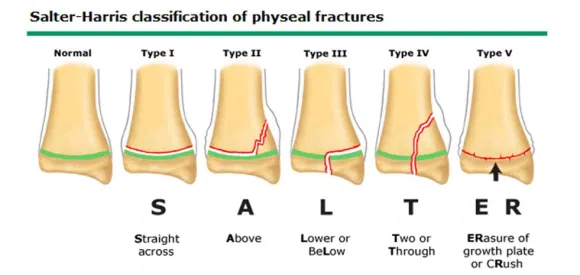

# Salter-Harris klassifikationen

Q. Hvad menes i sundhedsvæsenet med *[[Salter-Harris klassifikationen]]*? 
A. *Klassifikation af [[Epifysiolysefraktur]]*

Q. Hvad hedder *Klassifikation af [[Epifysiolysefraktur]]* i sundhedsvæsenet? 
A. *[[Salter-Harris klassifikationen]]* 

Q. Hvilke typer indgår i [[Salter-Harris klassifikationen]]?
A. 1) Straight across, 2) Above, 3) BeLow, 4) Through eller 5) ERased. SALTER.

## Backlinks
* [[Epifysiolysefraktur]]
	* Graderes efter [[Salter-Harris klassifikationen]].
* [[Salter-Harris klassifikationen]]
	* Q. Hvad menes i sundhedsvæsenet med *[[Salter-Harris klassifikationen]]*? 
	* Q. Hvad hedder *Klassifikation af [[Epifysiolysefraktur]]* i sundhedsvæsenet? 
	* Q. Hvilke typer indgår i [[Salter-Harris klassifikationen]]?

<!-- #anki/tag/med/Orto #anki/deck/Medicine -->

<!-- {BearID:09418802-8F4F-4E11-B175-D680422266D2-3420-00000BB4BD8AFBE2} -->
