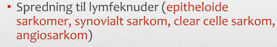
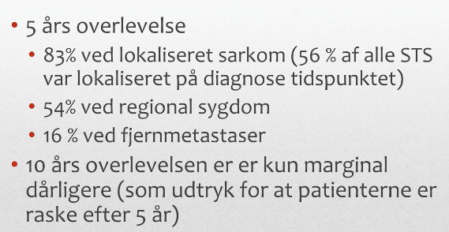

# Sarkomer
## Generelt

## Differentialdiagnose

## Udredning
### Anamnese
Q. Hvilke karakteristika ved en knude i bevægeapparatet vil tyde på sarkom?
A. S: På eller under fascie, fast adhærent, O: Hurtigt voksende (uger-måneder), C: > 5 cm

Q. Beskriv SOCRATES for smerterne ved maligne knogletumores.
A. S: Knoglen, O: Gradvist tiltagende, T: Natlige, E: I hvile

### Objektiv us.

### Paraklinik
[[Radiologi ved sarkomer]]

Q. Hvor metastaserer sarkomer sig typisk til?
A. Næsten altid hæmatogent: Lunger (og lever for de abdominale)

Pånær:

Q. Hvilken billeddiagnostik bruges ved knogletumores?
A. Rtg., MR eller skintigrafi/PET (IKKE CT)

Q. Hvorfor bruges ikke CT ved knogletumores?
A. Kan først påvise tumorindvækst når knoglen er destrueret 

Q. Hvordan diagnosticeres sarkom endeligt?
A. Gentagne biopsier

Q. Hvorfor skal tages gentagne biopsier ved mistanke om sarkom?
A. De er heterogene histologisk med både maligne og benigne komponenter

## Behandling
Q. Benævn de forskellige graderinger af tumor-resektion.
A. Intralæsionel, marginal, vid og radikal

Q. Hvordan adskiller vid resektion sig fra radikal?
A. Vid er tumor + sund bræmme, radikal er et helt compartment.

Kirurgi og strålebehandling, kemoterapi har ikke eftervist effekt ved højmalign sygdom. 

## Opfølgning

## Prognose

## Backlinks
* [[Knogletumores]]
	* Q. Hvad skyldes en malign tumor i knogle typisk?
* [[Tumorer i bevægeapparatet]]
	* [[Sarkomer]]

<!-- #anki/tag/med/Orto #anki/deck/Medicine #anki/tag/med/Oncology #anki/tag/med/Abdominal surgery# -->

<!-- {BearID:10D9DCA0-125F-4E3D-ABBB-23A2B15AA76C-24378-0000E79E31CA5903} -->
